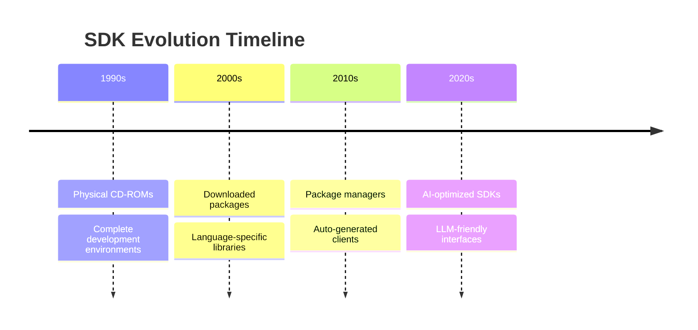
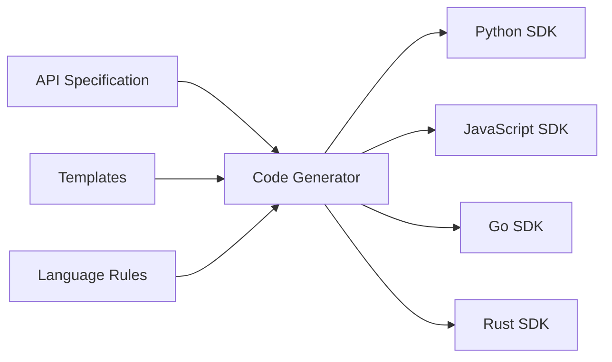
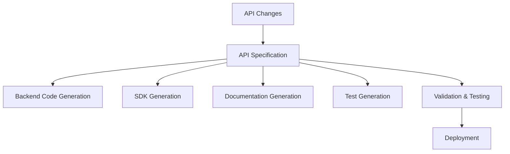

# The Complete Guide to Building Better AI SDKs

*A comprehensive guide to creating SDKs that developers and LLMs will find intuitive to use, with modern approaches for building and maintaining high-quality software development kits.*

## Table of Contents

1. [Introduction](#introduction)
2. [Understanding SDKs](#understanding-sdks)
3. [Why Build an SDK?](#why-build-an-sdk)
4. [The SDK Development Ladder](#the-sdk-development-ladder)
5. [Best Practices for AI-Era SDKs](#best-practices-for-ai-era-sdks)
6. [Implementation Strategies](#implementation-strategies)
7. [Maintenance and Operations](#maintenance-and-operations)
8. [Advanced Considerations](#advanced-considerations)
9. [Future-Proofing Your SDK](#future-proofing-your-sdk)
10. [Conclusion](#conclusion)

---

## Introduction

In today's rapidly evolving AI landscape, Software Development Kits (SDKs) have become more crucial than ever. As AI tools and Large Language Models (LLMs) increasingly interact with APIs through SDKs, the quality and usability of these development tools directly impact adoption and success.

This guide provides a comprehensive framework for building SDKs that excel in both human and AI interactions, drawing from industry best practices and real-world experiences from companies like Elastic, AWS, Stripe, and others.

### Why This Matters Now

- **AI Integration**: LLMs are increasingly using SDKs to interact with services
- **Developer Experience**: Competition is fierce, and developer experience is a key differentiator
- **Ecosystem Growth**: Well-designed SDKs accelerate platform adoption
- **Maintenance Efficiency**: Modern approaches can dramatically reduce maintenance overhead

---

## Understanding SDKs

### What is an SDK?

Historically, SDKs were comprehensive development toolkits distributed on physical media. Today, they've evolved into specialized libraries that enable third-party developers to integrate with specific technologies or services.

**Modern SDK Definition**: A library that provides a simplified, language-native interface to interact with HTTP APIs, complete with:
- Type safety and IDE support
- Error handling and retry logic
- Authentication management
- Documentation and examples

### SDK vs. Framework vs. API

| Aspect | SDK | Framework | Raw API |
|--------|-----|-----------|---------|
| **Control Flow** | You call it | It calls you | You manage everything |
| **Architecture** | Non-opinionated | Highly opinionated | No opinion |
| **Complexity** | Simplified interface | Structured patterns | Full complexity exposed |
| **Use Case** | Service integration | Application structure | Direct protocol access |

### Evolution of SDKs



---

## Why Build an SDK?

### The Value Proposition

Building an SDK over just providing a raw API offers significant advantages:

#### 1. **Simplified API Usage**

**Without SDK** (Raw HTTP):
```python
import requests
import json

headers = {
    'Authorization': 'Bearer your-token',
    'Content-Type': 'application/json'
}

payload = {
    'query': {
        'bool': {
            'must': [
                {'match': {'title': 'AI SDK'}},
                {'range': {'date': {'gte': '2024-01-01'}}}
            ]
        }
    }
}

response = requests.post(
    'https://api.example.com/search',
    headers=headers,
    data=json.dumps(payload)
)

if response.status_code == 200:
    results = response.json()
else:
    # Handle various error codes manually
    pass
```

**With SDK**:
```python
from example_sdk import Client

client = Client(api_key='your-token')

results = client.search.query(
    title='AI SDK',
    date_range={'gte': '2024-01-01'}
)
```

#### 2. **Enhanced Developer Experience**

- **IDE Integration**: Autocompletion, type hints, and inline documentation
- **Type Safety**: Compile-time error detection
- **Discoverability**: Explore API surface through code navigation
- **Consistent Patterns**: Uniform interface across different endpoints

#### 3. **Robust Error Handling**

SDKs should provide:
- **Specific Exceptions**: Granular error types for different scenarios
- **Automatic Retries**: Built-in retry logic with exponential backoff
- **Clear Error Messages**: Human-readable error descriptions

```python
try:
    result = client.inference.create(model='gpt-4', prompt='Hello')
except client.exceptions.RateLimitError as e:
    # Handle rate limiting specifically
    time.sleep(e.retry_after)
except client.exceptions.AuthenticationError:
    # Handle auth issues
    refresh_token()
except client.exceptions.ModelNotFoundError:
    # Handle model availability
    fallback_to_different_model()
```

#### 4. **Language-Specific Optimizations**

Each programming language has unique features that SDKs can leverage:

**Python**: Async/await support, context managers, decorators
```python
async with client.stream('gpt-4') as stream:
    async for chunk in stream.chat(['Hello, world!']):
        print(chunk.content)
```

**JavaScript**: Promise chains, async/await, multiple runtime support
```javascript
const stream = await client.chat.completions.create({
    model: 'gpt-4',
    messages: [{ role: 'user', content: 'Hello!' }],
    stream: true
});

for await (const chunk of stream) {
    console.log(chunk.choices[0]?.delta?.content || '');
}
```

**TypeScript**: Advanced type inference and compile-time safety
```typescript
interface ChatCompletion {
    model: 'gpt-4' | 'gpt-3.5-turbo';
    messages: Array<{
        role: 'system' | 'user' | 'assistant';
        content: string;
    }>;
}

const completion = await client.chat.completions.create({
    model: 'gpt-4', // TypeScript ensures this is valid
    messages: [{ role: 'user', content: 'Hello!' }]
});
```

#### 5. **Authentication Abstraction**

SDKs handle complex authentication flows:
- API key management
- OAuth flows
- Token refresh
- Multi-region authentication

```python
# Simple configuration, complex authentication handled internally
client = Client(
    api_key='your-key',
    region='us-west-2',
    auto_refresh=True
)
```

#### 6. **Built-in Observability**

Modern SDKs should include:
- **OpenTelemetry Integration**: Standardized metrics and tracing
- **Performance Monitoring**: Request timing and success rates
- **Debug Logging**: Detailed request/response logging for troubleshooting

```python
import logging
from opentelemetry import trace

# SDK automatically instruments calls
client = Client(
    api_key='your-key',
    enable_telemetry=True,
    log_level=logging.DEBUG
)

# Automatic tracing of all SDK calls
tracer = trace.get_tracer(__name__)
with tracer.start_as_current_span("ai_completion"):
    result = client.completions.create(prompt="Hello")
```

---

## The SDK Development Ladder

The approach to building SDKs can be viewed as a ladder, where each step up provides more automation but less control:

### Level 1: Manually-Written SDKs

**When to Use**: Small APIs, unique requirements, or proof-of-concept projects.

**Advantages**:
- Complete control over implementation
- Highly optimized for specific use cases
- Can implement unique language features
- Fast initial development for small APIs

**Disadvantages**:
- Doesn't scale well
- Inconsistency across languages
- High maintenance overhead
- Prone to API drift

**Example Structure**:
```
sdk/
├── src/
│   ├── client.py
│   ├── models/
│   │   ├── completion.py
│   │   └── embedding.py
│   ├── resources/
│   │   ├── chat.py
│   │   └── embeddings.py
│   └── exceptions.py
├── tests/
└── docs/
```

### Level 2: In-House Generators

**When to Use**: Medium to large APIs where you need control over the generation process.

**Advantages**:
- Consistent across languages
- Scales with API growth
- Custom optimizations possible
- Maintains API-SDK synchronization

**Disadvantages**:
- Requires significant upfront investment
- Maintenance of generator tooling
- Custom toolchain complexity

**Implementation Example**:
```yaml
# api-spec.yaml
endpoints:
  - name: create_completion
    method: POST
    path: /v1/completions
    parameters:
      - name: prompt
        type: string
        required: true
      - name: model
        type: string
        required: true
        enum: [gpt-4, gpt-3.5-turbo]
    response:
      type: object
      properties:
        id: string
        choices: array
```

**Generator Architecture**:


### Level 3: General-Purpose Generators

**When to Use**: Standard REST APIs that fit common patterns.

**Popular Tools**:
- **OpenAPI Generator**: Supports 50+ languages
- **AWS Smithy**: Amazon's protocol-agnostic framework
- **Microsoft TypeSpec**: Type-safe API definitions

**Advantages**:
- Proven tooling
- Community support
- Multiple language support
- Standardized patterns

**Disadvantages**:
- Less customization
- May not fit unique requirements
- Generated code quality varies

**OpenAPI Example**:
```yaml
openapi: 3.0.0
info:
  title: AI API
  version: 1.0.0
paths:
  /v1/completions:
    post:
      operationId: createCompletion
      requestBody:
        content:
          application/json:
            schema:
              $ref: '#/components/schemas/CompletionRequest'
      responses:
        '200':
          content:
            application/json:
              schema:
                $ref: '#/components/schemas/CompletionResponse'
```

### Level 4: API-First Design

**When to Use**: New projects or major API redesigns.

The ideal approach where the API specification drives both the backend implementation and SDK generation.

**Benefits**:
- Single source of truth
- Automatic SDK updates
- Consistent behavior
- Reduced maintenance

**Implementation Flow**:


---

## Best Practices for AI-Era SDKs

### 1. LLM-Friendly Design

#### Predictable Patterns
LLMs work best with consistent, predictable interfaces:

```python
# Good: Consistent pattern
client.chat.completions.create(...)
client.embeddings.create(...)
client.images.create(...)

# Bad: Inconsistent pattern
client.create_chat_completion(...)
client.get_embeddings(...)
client.generate_image(...)
```

#### Clear Method Names
Use descriptive, unambiguous method names:

```python
# Good
client.models.list()
client.models.retrieve(model_id='gpt-4')
client.models.delete(model_id='custom-model')

# Bad
client.get_models()
client.get_model(model_id='gpt-4')
client.remove_model(model_id='custom-model')
```

#### Comprehensive Type Hints
Provide detailed type information:

```python
from typing import List, Optional, Union, Literal
from dataclasses import dataclass

@dataclass
class ChatMessage:
    role: Literal['system', 'user', 'assistant']
    content: str
    name: Optional[str] = None

class CompletionsResource:
    def create(
        self,
        model: str,
        messages: List[ChatMessage],
        temperature: Optional[float] = None,
        max_tokens: Optional[int] = None,
        stream: bool = False
    ) -> Union[ChatCompletion, Iterator[ChatCompletionChunk]]:
        """Create a chat completion."""
        pass
```

### 2. Documentation for Humans and AI

#### Structured Documentation
Follow the Diátaxis framework:

```markdown
## Reference Documentation
Complete API reference with all parameters and return types.

## Tutorials
Step-by-step guides for common use cases.

## How-to Guides
Problem-oriented recipes for specific scenarios.

## Explanations
Understanding-oriented discussions of key concepts.
```

#### Code Examples in Multiple Languages
Provide working examples:

```python
# Python
client = OpenAI(api_key='your-key')
response = client.chat.completions.create(
    model='gpt-4',
    messages=[{'role': 'user', 'content': 'Hello!'}]
)
```

```javascript
// JavaScript
const client = new OpenAI({ apiKey: 'your-key' });
const response = await client.chat.completions.create({
    model: 'gpt-4',
    messages: [{ role: 'user', content: 'Hello!' }]
});
```

#### LLM-Specific Documentation
Consider providing:
- `/llms.txt` file with SDK usage patterns
- Markdown versions of documentation
- Integration examples with popular AI frameworks

### 3. Error Handling Best Practices

#### Specific Exception Types
Create granular exception hierarchies:

```python
class AISDKError(Exception):
    """Base exception for all SDK errors."""
    pass

class APIError(AISDKError):
    """API-related errors."""
    def __init__(self, message, status_code, response_body):
        super().__init__(message)
        self.status_code = status_code
        self.response_body = response_body

class RateLimitError(APIError):
    """Rate limit exceeded."""
    def __init__(self, message, retry_after=None):
        super().__init__(message, 429, None)
        self.retry_after = retry_after

class ModelNotFoundError(APIError):
    """Requested model not found."""
    pass

class AuthenticationError(APIError):
    """Authentication failed."""
    pass
```

#### Automatic Retry Logic
Implement intelligent retry mechanisms:

```python
import asyncio
import random
from typing import Optional

class RetryConfig:
    def __init__(
        self,
        max_retries: int = 3,
        base_delay: float = 1.0,
        max_delay: float = 60.0,
        jitter: bool = True
    ):
        self.max_retries = max_retries
        self.base_delay = base_delay
        self.max_delay = max_delay
        self.jitter = jitter

async def retry_with_backoff(
    func,
    retry_config: RetryConfig,
    retryable_errors: tuple = (RateLimitError, APIError)
):
    for attempt in range(retry_config.max_retries + 1):
        try:
            return await func()
        except retryable_errors as e:
            if attempt == retry_config.max_retries:
                raise
            
            delay = min(
                retry_config.base_delay * (2 ** attempt),
                retry_config.max_delay
            )
            
            if retry_config.jitter:
                delay *= (0.5 + random.random() * 0.5)
            
            await asyncio.sleep(delay)
```

### 4. Streaming and Real-time Features

#### Server-Sent Events Support
Many AI APIs use streaming for real-time responses:

```python
async def stream_completion(self, **kwargs):
    """Stream a completion response."""
    kwargs['stream'] = True
    
    async with self._make_request('POST', '/completions', json=kwargs) as response:
        async for line in response.content:
            if line.startswith(b'data: '):
                data = line[6:].decode('utf-8').strip()
                if data == '[DONE]':
                    break
                yield json.loads(data)
```

#### WebSocket Support
For real-time bidirectional communication:

```python
import websockets
import json

class RealtimeClient:
    def __init__(self, api_key: str):
        self.api_key = api_key
        self.websocket = None
    
    async def connect(self):
        headers = {'Authorization': f'Bearer {self.api_key}'}
        self.websocket = await websockets.connect(
            'wss://api.example.com/v1/realtime',
            extra_headers=headers
        )
    
    async def send_message(self, message: dict):
        await self.websocket.send(json.dumps(message))
    
    async def listen(self):
        async for message in self.websocket:
            yield json.loads(message)
```

### 5. Performance Optimization

#### Connection Pooling
Reuse connections for better performance:

```python
import aiohttp
from typing import Optional

class OptimizedClient:
    def __init__(self, api_key: str):
        self.api_key = api_key
        self._session: Optional[aiohttp.ClientSession] = None
    
    async def _get_session(self) -> aiohttp.ClientSession:
        if self._session is None or self._session.closed:
            connector = aiohttp.TCPConnector(
                limit=100,  # Total connection pool size
                limit_per_host=30,  # Per-host connection limit
                ttl_dns_cache=300,  # DNS cache TTL
                use_dns_cache=True
            )
            
            self._session = aiohttp.ClientSession(
                connector=connector,
                timeout=aiohttp.ClientTimeout(total=30),
                headers={'Authorization': f'Bearer {self.api_key}'}
            )
        
        return self._session
```

#### Efficient Serialization
Use fast JSON libraries when available:

```python
try:
    import orjson as json
    def dumps(obj): return orjson.dumps(obj).decode()
    loads = orjson.loads
except ImportError:
    import json
    dumps = json.dumps
    loads = json.loads
```

#### Batch Operations
Support batching for efficiency:

```python
async def batch_embeddings(self, texts: List[str], model: str) -> List[Embedding]:
    """Create embeddings for multiple texts in a single request."""
    response = await self._post('/embeddings', {
        'input': texts,
        'model': model
    })
    return [Embedding(**emb) for emb in response['data']]
```

---

## Implementation Strategies

### Project Structure

#### Modular Architecture
Organize code for maintainability:

```
ai_sdk/
├── __init__.py
├── client.py              # Main client class
├── _base_client.py        # Base HTTP client
├── _constants.py          # API constants
├── _exceptions.py         # Exception definitions
├── _utils.py             # Utility functions
├── resources/            # API resource modules
│   ├── __init__.py
│   ├── chat.py
│   ├── embeddings.py
│   ├── images.py
│   └── models.py
├── types/               # Type definitions
│   ├── __init__.py
│   ├── chat.py
│   ├── embedding.py
│   └── shared.py
└── _streaming.py        # Streaming utilities
```

#### Resource-Based Organization
Group related functionality:

```python
# resources/chat.py
from typing import List, Optional, Union, Iterator
from .._base_client import BaseResource
from ..types.chat import ChatCompletion, ChatCompletionChunk

class ChatResource(BaseResource):
    def __init__(self, client):
        super().__init__(client)
    
    def create(
        self,
        model: str,
        messages: List[dict],
        stream: bool = False,
        **kwargs
    ) -> Union[ChatCompletion, Iterator[ChatCompletionChunk]]:
        """Create a chat completion."""
        if stream:
            return self._create_stream(model, messages, **kwargs)
        return self._create_sync(model, messages, **kwargs)
```

### Configuration Management

#### Hierarchical Configuration
Support multiple configuration sources:

```python
import os
from typing import Optional
from dataclasses import dataclass, field

@dataclass
class ClientConfig:
    api_key: Optional[str] = None
    base_url: str = "https://api.example.com/v1"
    timeout: float = 30.0
    max_retries: int = 3
    default_headers: dict = field(default_factory=dict)
    
    def __post_init__(self):
        # Hierarchy: explicit > environment > default
        if self.api_key is None:
            self.api_key = os.getenv('AI_API_KEY')
        
        if not self.api_key:
            raise ValueError("API key must be provided")

class Client:
    def __init__(self, config: Optional[ClientConfig] = None, **kwargs):
        if config is None:
            config = ClientConfig(**kwargs)
        self.config = config
```

### Testing Strategies

#### Mock-Friendly Design
Make testing easy with dependency injection:

```python
from abc import ABC, abstractmethod
from typing import Any, Dict

class HTTPClient(ABC):
    @abstractmethod
    async def request(self, method: str, url: str, **kwargs) -> Dict[str, Any]:
        pass

class RealHTTPClient(HTTPClient):
    async def request(self, method: str, url: str, **kwargs) -> Dict[str, Any]:
        # Real HTTP implementation
        pass

class Client:
    def __init__(self, api_key: str, http_client: Optional[HTTPClient] = None):
        self.api_key = api_key
        self.http_client = http_client or RealHTTPClient()
```

#### Comprehensive Test Suite
Cover all major scenarios:

```python
import pytest
from unittest.mock import AsyncMock

class TestChatResource:
    @pytest.fixture
    def mock_client(self):
        client = AsyncMock()
        return client
    
    @pytest.fixture
    def chat_resource(self, mock_client):
        return ChatResource(mock_client)
    
    async def test_create_completion_success(self, chat_resource, mock_client):
        # Arrange
        mock_client.request.return_value = {
            'id': 'completion-123',
            'choices': [{'message': {'content': 'Hello!'}}]
        }
        
        # Act
        result = await chat_resource.create(
            model='gpt-4',
            messages=[{'role': 'user', 'content': 'Hi'}]
        )
        
        # Assert
        assert result.id == 'completion-123'
        mock_client.request.assert_called_once()
    
    async def test_create_completion_rate_limit(self, chat_resource, mock_client):
        # Test rate limiting scenarios
        mock_client.request.side_effect = RateLimitError("Rate limited", retry_after=60)
        
        with pytest.raises(RateLimitError) as exc_info:
            await chat_resource.create(model='gpt-4', messages=[])
        
        assert exc_info.value.retry_after == 60
```

---

## Maintenance and Operations

### Versioning Strategy

#### Semantic Versioning
Follow semantic versioning principles:

- **MAJOR**: Breaking changes
- **MINOR**: New features, backward compatible
- **PATCH**: Bug fixes, backward compatible

```python
# Version handling
__version__ = "2.1.0"

class Client:
    def __init__(self, api_key: str):
        self.api_key = api_key
        self.user_agent = f"ai-sdk-python/{__version__}"
```

#### Deprecation Management
Handle deprecated features gracefully:

```python
import warnings
from typing import Optional

def deprecated_method(self, old_param: str, new_param: Optional[str] = None):
    warnings.warn(
        "deprecated_method is deprecated and will be removed in v3.0. "
        "Use new_method instead.",
        DeprecationWarning,
        stacklevel=2
    )
    
    if new_param is None:
        new_param = old_param
    
    return self.new_method(new_param)
```

### Monitoring and Analytics

#### Usage Tracking
Implement privacy-respecting analytics:

```python
import hashlib
from typing import Optional

class TelemetryCollector:
    def __init__(self, enabled: bool = True, endpoint: Optional[str] = None):
        self.enabled = enabled
        self.endpoint = endpoint
    
    def track_api_call(self, method: str, endpoint: str, status_code: int):
        if not self.enabled:
            return
        
        # Hash sensitive data
        hashed_endpoint = hashlib.sha256(endpoint.encode()).hexdigest()[:8]
        
        event = {
            'event': 'api_call',
            'method': method,
            'endpoint_hash': hashed_endpoint,
            'status_code': status_code,
            'sdk_version': __version__,
            'timestamp': time.time()
        }
        
        self._send_event(event)
```

#### Health Checks
Monitor SDK and API health:

```python
class HealthChecker:
    def __init__(self, client):
        self.client = client
    
    async def check_health(self) -> dict:
        """Perform health checks on the API."""
        try:
            # Simple API call to check connectivity
            models = await self.client.models.list()
            return {
                'status': 'healthy',
                'api_accessible': True,
                'model_count': len(models.data),
                'timestamp': time.time()
            }
        except Exception as e:
            return {
                'status': 'unhealthy',
                'api_accessible': False,
                'error': str(e),
                'timestamp': time.time()
            }
```

### Community Management

#### Open Source Best Practices
If open-sourcing your SDK:

1. **Clear Contributing Guidelines**
```markdown
# Contributing to AI SDK

## Development Setup
1. Clone the repository
2. Install dependencies: `pip install -e ".[dev]"`
3. Run tests: `pytest`

## Pull Request Process
1. Fork the repository
2. Create a feature branch
3. Add tests for new functionality
4. Ensure all tests pass
5. Submit a pull request

## Code Style
- Follow PEP 8 for Python code
- Use type hints for all public APIs
- Add docstrings to all public methods
```

2. **Issue Templates**
```markdown
---
name: Bug Report
about: Create a report to help us improve
---

**Describe the bug**
A clear description of what the bug is.

**To Reproduce**
Steps to reproduce the behavior:
1. Initialize client with '...'
2. Call method '...'
3. See error

**Expected behavior**
What you expected to happen.

**Environment:**
- SDK Version: [e.g. 2.1.0]
- Python Version: [e.g. 3.9]
- OS: [e.g. Ubuntu 20.04]
```

3. **Automated Quality Checks**
```yaml
# .github/workflows/ci.yml
name: CI
on: [push, pull_request]

jobs:
  test:
    runs-on: ubuntu-latest
    strategy:
      matrix:
        python-version: [3.8, 3.9, 3.10, 3.11, 3.12]
    
    steps:
    - uses: actions/checkout@v3
    - name: Set up Python
      uses: actions/setup-python@v4
      with:
        python-version: ${{ matrix.python-version }}
    
    - name: Install dependencies
      run: |
        pip install -e ".[dev]"
    
    - name: Run tests
      run: pytest --cov=ai_sdk --cov-report=xml
    
    - name: Upload coverage
      uses: codecov/codecov-action@v3
```

---

## Advanced Considerations

### Multi-Region Support

#### Intelligent Routing
Route requests to optimal endpoints:

```python
from enum import Enum
from typing import Dict, List

class Region(Enum):
    US_EAST_1 = "us-east-1"
    US_WEST_2 = "us-west-2"
    EU_WEST_1 = "eu-west-1"
    AP_SOUTHEAST_1 = "ap-southeast-1"

class RegionManager:
    def __init__(self):
        self.endpoints = {
            Region.US_EAST_1: "https://api-us-east-1.example.com",
            Region.US_WEST_2: "https://api-us-west-2.example.com",
            Region.EU_WEST_1: "https://api-eu-west-1.example.com",
            Region.AP_SOUTHEAST_1: "https://api-ap-southeast-1.example.com",
        }
        self.latencies: Dict[Region, float] = {}
    
    async def get_best_endpoint(self) -> str:
        """Return the endpoint with lowest latency."""
        if not self.latencies:
            await self._measure_latencies()
        
        best_region = min(self.latencies, key=self.latencies.get)
        return self.endpoints[best_region]
```

### Plugin Architecture

#### Extensible Design
Allow users to extend functionality:

```python
from abc import ABC, abstractmethod
from typing import Any, Dict

class Plugin(ABC):
    @abstractmethod
    def before_request(self, request: Dict[str, Any]) -> Dict[str, Any]:
        """Modify request before sending."""
        pass
    
    @abstractmethod
    def after_response(self, response: Dict[str, Any]) -> Dict[str, Any]:
        """Modify response after receiving."""
        pass

class LoggingPlugin(Plugin):
    def before_request(self, request: Dict[str, Any]) -> Dict[str, Any]:
        logger.info(f"Making request to {request['url']}")
        return request
    
    def after_response(self, response: Dict[str, Any]) -> Dict[str, Any]:
        logger.info(f"Received response with status {response['status_code']}")
        return response

class Client:
    def __init__(self, api_key: str):
        self.api_key = api_key
        self.plugins: List[Plugin] = []
    
    def add_plugin(self, plugin: Plugin):
        self.plugins.append(plugin)
    
    async def _make_request(self, method: str, url: str, **kwargs) -> Dict[str, Any]:
        request = {'method': method, 'url': url, **kwargs}
        
        # Apply before_request plugins
        for plugin in self.plugins:
            request = plugin.before_request(request)
        
        # Make actual request
        response = await self._http_request(**request)
        
        # Apply after_response plugins
        for plugin in self.plugins:
            response = plugin.after_response(response)
        
        return response
```

### Caching Strategies

#### Intelligent Caching
Cache responses when appropriate:

```python
import asyncio
import hashlib
import json
import time
from typing import Any, Dict, Optional

class CacheEntry:
    def __init__(self, data: Any, ttl: int):
        self.data = data
        self.expires_at = time.time() + ttl
    
    def is_expired(self) -> bool:
        return time.time() > self.expires_at

class ResponseCache:
    def __init__(self, default_ttl: int = 300):  # 5 minutes default
        self.cache: Dict[str, CacheEntry] = {}
        self.default_ttl = default_ttl
        self._lock = asyncio.Lock()
    
    def _generate_key(self, method: str, url: str, params: Dict[str, Any]) -> str:
        """Generate cache key from request parameters."""
        key_data = {
            'method': method,
            'url': url,
            'params': sorted(params.items()) if params else []
        }
        key_string = json.dumps(key_data, sort_keys=True)
        return hashlib.md5(key_string.encode()).hexdigest()
    
    async def get(self, method: str, url: str, params: Dict[str, Any]) -> Optional[Any]:
        """Get cached response if available and not expired."""
        async with self._lock:
            key = self._generate_key(method, url, params)
            entry = self.cache.get(key)
            
            if entry and not entry.is_expired():
                return entry.data
            elif entry:
                # Remove expired entry
                del self.cache[key]
            
            return None
    
    async def set(self, method: str, url: str, params: Dict[str, Any], data: Any, ttl: Optional[int] = None):
        """Cache response data."""
        async with self._lock:
            key = self._generate_key(method, url, params)
            ttl = ttl or self.default_ttl
            self.cache[key] = CacheEntry(data, ttl)

class CachedClient:
    def __init__(self, api_key: str, enable_cache: bool = True):
        self.api_key = api_key
        self.cache = ResponseCache() if enable_cache else None
    
    async def _make_request(self, method: str, url: str, **kwargs) -> Dict[str, Any]:
        # Only cache GET requests and specific safe operations
        cacheable = method == 'GET' or self._is_idempotent_operation(url)
        
        if cacheable and self.cache:
            cached_response = await self.cache.get(method, url, kwargs)
            if cached_response:
                return cached_response
        
        response = await self._http_request(method, url, **kwargs)
        
        if cacheable and self.cache and response.get('status_code') == 200:
            await self.cache.set(method, url, kwargs, response)
        
        return response
    
    def _is_idempotent_operation(self, url: str) -> bool:
        """Determine if operation is safe to cache."""
        idempotent_patterns = [
            '/models',
            '/organizations',
            '/usage'  # Usage stats might be cacheable for short periods
        ]
        return any(pattern in url for pattern in idempotent_patterns)
```

### Security Considerations

#### API Key Management
Secure handling of sensitive credentials:

```python
import os
import keyring
from typing import Optional
from cryptography.fernet import Fernet

class SecureCredentialManager:
    def __init__(self, service_name: str = "ai-sdk"):
        self.service_name = service_name
        self._encryption_key = self._get_or_create_encryption_key()
    
    def _get_or_create_encryption_key(self) -> bytes:
        """Get or create encryption key for local storage."""
        key = keyring.get_password(self.service_name, "encryption_key")
        if not key:
            key = Fernet.generate_key().decode()
            keyring.set_password(self.service_name, "encryption_key", key)
        return key.encode()
    
    def store_api_key(self, api_key: str, profile: str = "default"):
        """Securely store API key."""
        fernet = Fernet(self._encryption_key)
        encrypted_key = fernet.encrypt(api_key.encode())
        keyring.set_password(self.service_name, f"api_key_{profile}", encrypted_key.decode())
    
    def get_api_key(self, profile: str = "default") -> Optional[str]:
        """Retrieve stored API key."""
        encrypted_key = keyring.get_password(self.service_name, f"api_key_{profile}")
        if not encrypted_key:
            return None
        
        fernet = Fernet(self._encryption_key)
        return fernet.decrypt(encrypted_key.encode()).decode()

class SecureClient:
    def __init__(self, api_key: Optional[str] = None, profile: str = "default"):
        self.credential_manager = SecureCredentialManager()
        
        if api_key:
            self.api_key = api_key
        else:
            # Try to load from secure storage
            self.api_key = self.credential_manager.get_api_key(profile)
            
        if not self.api_key:
            # Fallback to environment variable
            self.api_key = os.getenv('AI_API_KEY')
            
        if not self.api_key:
            raise ValueError("API key must be provided or stored securely")
    
    def _sanitize_for_logging(self, data: dict) -> dict:
        """Remove sensitive data from logs."""
        sanitized = data.copy()
        sensitive_keys = ['api_key', 'authorization', 'password', 'token']
        
        for key in sensitive_keys:
            if key in sanitized:
                sanitized[key] = "***REDACTED***"
        
        return sanitized
```

#### Request Signing
For enhanced security, implement request signing:

```python
import hmac
import hashlib
import time
from typing import Dict, Any

class RequestSigner:
    def __init__(self, secret_key: str):
        self.secret_key = secret_key.encode()
    
    def sign_request(self, method: str, url: str, body: str, timestamp: int) -> str:
        """Generate HMAC signature for request."""
        message = f"{method}\n{url}\n{body}\n{timestamp}"
        signature = hmac.new(
            self.secret_key,
            message.encode(),
            hashlib.sha256
        ).hexdigest()
        return signature
    
    def add_signature_headers(self, headers: Dict[str, str], method: str, url: str, body: str) -> Dict[str, str]:
        """Add signature headers to request."""
        timestamp = int(time.time())
        signature = self.sign_request(method, url, body, timestamp)
        
        headers.update({
            'X-Timestamp': str(timestamp),
            'X-Signature': signature
        })
        
        return headers
```

---

## Future-Proofing Your SDK

### API Evolution Strategies

#### Graceful Degradation
Handle API changes gracefully:

```python
from typing import Any, Dict, Optional
import logging

logger = logging.getLogger(__name__)

class APIVersionManager:
    def __init__(self, client_version: str, supported_versions: list):
        self.client_version = client_version
        self.supported_versions = supported_versions
        self.server_version: Optional[str] = None
    
    async def negotiate_version(self, client) -> str:
        """Negotiate API version with server."""
        try:
            info = await client._get('/info')
            self.server_version = info.get('api_version')
            
            if self.server_version in self.supported_versions:
                return self.server_version
            else:
                logger.warning(f"Server version {self.server_version} not supported. Using {self.client_version}")
                return self.client_version
        except Exception as e:
            logger.warning(f"Could not negotiate API version: {e}")
            return self.client_version
    
    def transform_request(self, request: Dict[str, Any], api_version: str) -> Dict[str, Any]:
        """Transform request based on API version."""
        if api_version == "v1":
            return self._transform_to_v1(request)
        elif api_version == "v2":
            return self._transform_to_v2(request)
        return request
    
    def _transform_to_v1(self, request: Dict[str, Any]) -> Dict[str, Any]:
        """Transform request for API v1."""
        # Handle parameter name changes, structure differences, etc.
        transformed = request.copy()
        
        # Example: v2 uses 'max_tokens', v1 uses 'max_length'
        if 'max_tokens' in transformed:
            transformed['max_length'] = transformed.pop('max_tokens')
        
        return transformed
```

#### Forward Compatibility
Design for unknown future fields:

```python
from dataclasses import dataclass, field
from typing import Any, Dict, Optional

@dataclass
class FlexibleResponse:
    """Response class that handles unknown fields gracefully."""
    id: str
    status: str
    known_field: Optional[str] = None
    
    # Store unknown fields for forward compatibility
    _unknown_fields: Dict[str, Any] = field(default_factory=dict, repr=False)
    
    @classmethod
    def from_dict(cls, data: Dict[str, Any]) -> 'FlexibleResponse':
        """Create instance from dictionary, preserving unknown fields."""
        known_fields = {f.name for f in cls.__dataclass_fields__.values() if not f.name.startswith('_')}
        
        kwargs = {}
        unknown = {}
        
        for key, value in data.items():
            if key in known_fields:
                kwargs[key] = value
            else:
                unknown[key] = value
        
        instance = cls(**kwargs)
        instance._unknown_fields = unknown
        return instance
    
    def to_dict(self) -> Dict[str, Any]:
        """Convert to dictionary, including unknown fields."""
        result = {
            'id': self.id,
            'status': self.status
        }
        
        if self.known_field is not None:
            result['known_field'] = self.known_field
        
        result.update(self._unknown_fields)
        return result
```

### AI-First Development

#### LLM Integration Testing
Test how well LLMs can use your SDK:

```python
import asyncio
from typing import List, Dict, Any

class LLMUsabilityTester:
    def __init__(self, sdk_client):
        self.client = sdk_client
    
    async def test_common_patterns(self) -> Dict[str, Any]:
        """Test common usage patterns that LLMs might attempt."""
        results = {}
        
        test_cases = [
            ("simple_completion", self._test_simple_completion),
            ("streaming_completion", self._test_streaming_completion),
            ("batch_processing", self._test_batch_processing),
            ("error_handling", self._test_error_handling),
        ]
        
        for test_name, test_func in test_cases:
            try:
                start_time = time.time()
                result = await test_func()
                duration = time.time() - start_time
                
                results[test_name] = {
                    "success": True,
                    "duration": duration,
                    "result": result
                }
            except Exception as e:
                results[test_name] = {
                    "success": False,
                    "error": str(e),
                    "error_type": type(e).__name__
                }
        
        return results
    
    async def _test_simple_completion(self):
        """Test basic completion functionality."""
        response = await self.client.chat.completions.create(
            model="gpt-4",
            messages=[{"role": "user", "content": "Hello, world!"}]
        )
        return {"response_length": len(response.choices[0].message.content)}
    
    async def _test_streaming_completion(self):
        """Test streaming functionality."""
        stream = await self.client.chat.completions.create(
            model="gpt-4",
            messages=[{"role": "user", "content": "Count to 5"}],
            stream=True
        )
        
        chunks = []
        async for chunk in stream:
            if chunk.choices[0].delta.content:
                chunks.append(chunk.choices[0].delta.content)
        
        return {"chunk_count": len(chunks)}
    
    def generate_usage_examples(self) -> List[str]:
        """Generate code examples for documentation."""
        examples = [
            """
# Simple completion
client = AIClient(api_key="your-key")
response = await client.chat.completions.create(
    model="gpt-4",
    messages=[{"role": "user", "content": "Hello!"}]
)
print(response.choices[0].message.content)
            """,
            """
# Streaming completion
async for chunk in client.chat.completions.create(
    model="gpt-4",
    messages=[{"role": "user", "content": "Tell me a story"}],
    stream=True
):
    if chunk.choices[0].delta.content:
        print(chunk.choices[0].delta.content, end="")
            """,
            """
# Error handling
try:
    response = await client.chat.completions.create(
        model="invalid-model",
        messages=[{"role": "user", "content": "Hello"}]
    )
except client.exceptions.ModelNotFoundError:
    print("Model not found, using fallback")
    response = await client.chat.completions.create(
        model="gpt-3.5-turbo",
        messages=[{"role": "user", "content": "Hello"}]
    )
            """
        ]
        return examples
```

#### SDK Analytics for LLM Usage
Track how LLMs use your SDK differently from humans:

```python
import json
import asyncio
from typing import Dict, Any, Optional
from dataclasses import dataclass, asdict
from datetime import datetime

@dataclass
class UsageEvent:
    event_type: str
    method: str
    parameters: Dict[str, Any]
    success: bool
    duration_ms: float
    error_type: Optional[str] = None
    user_agent: Optional[str] = None
    timestamp: str = ""
    
    def __post_init__(self):
        if not self.timestamp:
            self.timestamp = datetime.utcnow().isoformat()

class UsageAnalytics:
    def __init__(self, enabled: bool = True):
        self.enabled = enabled
        self.events: List[UsageEvent] = []
        self._llm_patterns = [
            "claude", "gpt", "llm", "ai-assistant", 
            "anthropic", "openai", "chatbot"
        ]
    
    def is_likely_llm_user(self, user_agent: str) -> bool:
        """Detect if user agent suggests LLM usage."""
        if not user_agent:
            return False
        
        user_agent_lower = user_agent.lower()
        return any(pattern in user_agent_lower for pattern in self._llm_patterns)
    
    def track_method_call(
        self,
        method: str,
        parameters: Dict[str, Any],
        success: bool,
        duration_ms: float,
        error_type: Optional[str] = None,
        user_agent: Optional[str] = None
    ):
        """Track SDK method usage."""
        if not self.enabled:
            return
        
        # Sanitize sensitive parameters
        safe_params = self._sanitize_parameters(parameters)
        
        event = UsageEvent(
            event_type="method_call",
            method=method,
            parameters=safe_params,
            success=success,
            duration_ms=duration_ms,
            error_type=error_type,
            user_agent=user_agent
        )
        
        self.events.append(event)
    
    def _sanitize_parameters(self, params: Dict[str, Any]) -> Dict[str, Any]:
        """Remove sensitive data but keep structure for analysis."""
        sanitized = {}
        
        for key, value in params.items():
            if key in ['api_key', 'password', 'token']:
                continue
            elif key == 'messages' and isinstance(value, list):
                # Keep message structure but not content
                sanitized[key] = [{"role": msg.get("role", "unknown")} for msg in value]
            elif isinstance(value, str) and len(value) > 100:
                # Truncate long strings
                sanitized[key] = f"<string length={len(value)}>"
            else:
                sanitized[key] = value
        
        return sanitized
    
    def get_usage_patterns(self) -> Dict[str, Any]:
        """Analyze usage patterns to improve SDK design."""
        if not self.events:
            return {}
        
        llm_events = [e for e in self.events if self.is_likely_llm_user(e.user_agent or "")]
        human_events = [e for e in self.events if not self.is_likely_llm_user(e.user_agent or "")]
        
        return {
            "total_events": len(self.events),
            "llm_usage": {
                "count": len(llm_events),
                "most_used_methods": self._get_method_frequency(llm_events),
                "avg_duration_ms": self._get_avg_duration(llm_events),
                "error_rate": self._get_error_rate(llm_events)
            },
            "human_usage": {
                "count": len(human_events),
                "most_used_methods": self._get_method_frequency(human_events),
                "avg_duration_ms": self._get_avg_duration(human_events),
                "error_rate": self._get_error_rate(human_events)
            },
            "recommendations": self._generate_recommendations(llm_events, human_events)
        }
    
    def _get_method_frequency(self, events: List[UsageEvent]) -> Dict[str, int]:
        """Get frequency of method calls."""
        frequency = {}
        for event in events:
            frequency[event.method] = frequency.get(event.method, 0) + 1
        return dict(sorted(frequency.items(), key=lambda x: x[1], reverse=True))
    
    def _get_avg_duration(self, events: List[UsageEvent]) -> float:
        """Get average duration of method calls."""
        if not events:
            return 0.0
        return sum(e.duration_ms for e in events) / len(events)
    
    def _get_error_rate(self, events: List[UsageEvent]) -> float:
        """Get error rate percentage."""
        if not events:
            return 0.0
        errors = sum(1 for e in events if not e.success)
        return (errors / len(events)) * 100
    
    def _generate_recommendations(self, llm_events: List[UsageEvent], human_events: List[UsageEvent]) -> List[str]:
        """Generate recommendations based on usage patterns."""
        recommendations = []
        
        if llm_events and human_events:
            llm_error_rate = self._get_error_rate(llm_events)
            human_error_rate = self._get_error_rate(human_events)
            
            if llm_error_rate > human_error_rate * 1.5:
                recommendations.append("LLMs have higher error rates - consider improving error messages and examples")
            
            llm_methods = set(e.method for e in llm_events)
            human_methods = set(e.method for e in human_events)
            
            llm_only_methods = llm_methods - human_methods
            if llm_only_methods:
                recommendations.append(f"Methods used only by LLMs: {list(llm_only_methods)} - ensure good documentation")
        
        return recommendations
```

### Continuous Improvement

#### Feedback Collection
Implement mechanisms to collect and act on feedback:

```python
import asyncio
import json
from typing import Dict, Any, Optional, Callable
from enum import Enum

class FeedbackType(Enum):
    BUG_REPORT = "bug_report"
    FEATURE_REQUEST = "feature_request"
    DOCUMENTATION = "documentation"
    PERFORMANCE = "performance"
    API_DESIGN = "api_design"

@dataclass
class FeedbackData:
    type: FeedbackType
    severity: str  # low, medium, high, critical
    description: str
    sdk_version: str
    method_name: Optional[str] = None
    error_details: Optional[Dict[str, Any]] = None
    user_context: Optional[Dict[str, Any]] = None
    timestamp: str = ""
    
    def __post_init__(self):
        if not self.timestamp:
            self.timestamp = datetime.utcnow().isoformat()

class FeedbackCollector:
    def __init__(self, feedback_endpoint: Optional[str] = None):
        self.feedback_endpoint = feedback_endpoint
        self.local_feedback: List[FeedbackData] = []
        self.feedback_handlers: Dict[FeedbackType, List[Callable]] = {}
    
    def register_handler(self, feedback_type: FeedbackType, handler: Callable):
        """Register a handler for specific feedback types."""
        if feedback_type not in self.feedback_handlers:
            self.feedback_handlers[feedback_type] = []
        self.feedback_handlers[feedback_type].append(handler)
    
    async def submit_feedback(self, feedback: FeedbackData):
        """Submit feedback through configured channels."""
        self.local_feedback.append(feedback)
        
        # Trigger registered handlers
        if feedback.type in self.feedback_handlers:
            for handler in self.feedback_handlers[feedback.type]:
                try:
                    await handler(feedback)
                except Exception as e:
                    logger.error(f"Feedback handler error: {e}")
        
        # Send to remote endpoint if configured
        if self.feedback_endpoint:
            try:
                await self._send_remote_feedback(feedback)
            except Exception as e:
                logger.error(f"Failed to send remote feedback: {e}")
    
    async def _send_remote_feedback(self, feedback: FeedbackData):
        """Send feedback to remote endpoint."""
        async with aiohttp.ClientSession() as session:
            async with session.post(
                self.feedback_endpoint,
                json=asdict(feedback)
            ) as response:
                if response.status != 200:
                    raise Exception(f"Feedback submission failed: {response.status}")

class SmartClient:
    def __init__(self, api_key: str, enable_feedback: bool = True):
        self.api_key = api_key
        self.feedback_collector = FeedbackCollector() if enable_feedback else None
        self._setup_error_feedback()
    
    def _setup_error_feedback(self):
        """Set up automatic feedback collection for errors."""
        if not self.feedback_collector:
            return
        
        async def auto_bug_report(feedback: FeedbackData):
            """Automatically create bug reports for critical errors."""
            if feedback.severity == "critical":
                logger.critical(f"Critical issue reported: {feedback.description}")
                # Could automatically create GitHub issues, alert teams, etc.
        
        self.feedback_collector.register_handler(FeedbackType.BUG_REPORT, auto_bug_report)
    
    async def _handle_error(self, error: Exception, method_name: str, **kwargs):
        """Handle errors and potentially collect feedback."""
        if self.feedback_collector and isinstance(error, APIError):
            feedback = FeedbackData(
                type=FeedbackType.BUG_REPORT,
                severity="high" if error.status_code >= 500 else "medium",
                description=f"API error in {method_name}: {str(error)}",
                sdk_version=__version__,
                method_name=method_name,
                error_details={
                    "status_code": error.status_code,
                    "response_body": error.response_body
                }
            )
            await self.feedback_collector.submit_feedback(feedback)
        raise error
```

---

## Conclusion

Building exceptional AI SDKs requires a thoughtful balance of developer experience, technical excellence, and forward-thinking design. As the AI ecosystem continues to evolve rapidly, SDKs that prioritize both human and AI usability will have a significant competitive advantage.

### Key Takeaways

1. **Start with Developer Experience**: Every design decision should prioritize ease of use and clarity
2. **Design for Both Humans and AI**: LLMs are increasingly important SDK consumers
3. **Build for Scale**: Use generators and automation to maintain consistency across languages
4. **Plan for Evolution**: APIs change, so build flexibility into your SDK architecture
5. **Invest in Quality**: Comprehensive testing, documentation, and monitoring pay dividends
6. **Listen to Your Users**: Implement feedback mechanisms and continuously improve

### The Path Forward

The future of SDK development lies in:
- **AI-First Design**: Optimizing for LLM consumption alongside human use
- **Intelligent Automation**: Using AI to generate better SDKs and documentation
- **Ecosystem Integration**: Seamless integration with popular AI frameworks and tools
- **Real-time Adaptation**: SDKs that can adapt to API changes automatically

### Getting Started

To implement these practices in your own SDK:

1. **Assess Your Current State**: Evaluate existing SDKs against these criteria
2. **Prioritize Improvements**: Start with the highest-impact changes
3. **Build Incrementally**: Implement improvements iteratively
4. **Measure Success**: Track adoption, error rates, and developer satisfaction
5. **Iterate Based on Feedback**: Use data to guide future improvements

Remember that building great SDKs is an ongoing process. The best SDKs evolve continuously, responding to user needs, technological changes, and ecosystem developments.

### Resources and Further Reading

- [OpenAPI Specification](https://spec.openapis.org/oas/latest.html)
- [Diátaxis Documentation Framework](https://diataxis.fr/)
- [OpenTelemetry Documentation](https://opentelemetry.io/docs/)
- [Semantic Versioning](https://semver.org/)
- [API Design Guidelines](https://github.com/microsoft/api-guidelines)

---

*This guide represents current best practices for SDK development in the AI era. As the field continues to evolve, these practices will need to adapt to new technologies, patterns, and user expectations.*
