# 🚀 Semantica: The Ultimate Knowledge Engineering Toolkit

> **"Transform Unstructured Data into Semantic Layers: Build Enterprise Knowledge Graphs with Engineering Precision"**

---

## 🎯 **What is Semantica?**

Semantica is a comprehensive toolkit for Knowledge Engineering and Semantic Layer construction. It transforms unstructured data into structured, queryable semantic layers with built-in quality controls, conflict detection, and full provenance tracking. Built for data engineers, knowledge engineers, and semantic architects.

---

## ✨ **Knowledge Engineering Toolkit Features**

### 🔥 **Core Knowledge Engineering Capabilities**
- **Unstructured Data Processing** - PDFs, documents, emails, social media, databases
- **Semantic Layer Construction** - Build enterprise-wide semantic models
- **Knowledge Graph Engineering** - Design, build, and maintain KG architectures
- **Quality-First Engineering** - Built-in validation, deduplication, conflict resolution
- **Enterprise Semantic Integration** - Connect disparate data sources into unified semantic layers

### 🎨 **Advanced Semantic Processing**
- **Multi-Modal Knowledge Extraction** - Text, images, tables, structured data
- **Semantic Understanding Engine** - Context-aware entity extraction and linking
- **Ontology Engineering** - Design and manage domain ontologies
- **Conflict Detection & Resolution** - Automatic identification of semantic disagreements
- **Real-time Knowledge Updates** - Stream processing and incremental semantic updates

---

## 🏗️ **Knowledge Engineering Architecture**

```
┌─────────────────────────────────────────────────────────────┐
│                Semantica Knowledge Engineering Toolkit    │
├─────────────────────────────────────────────────────────────┤
│  📊 Semantic Dashboard  │  🔧 Engineering CLI  │  📈 Quality Monitor │
├─────────────────────────────────────────────────────────────┤
│  🧠 Knowledge Engine   │  🔄 Engineering Pipeline │  🎯 Quality Control │
├─────────────────────────────────────────────────────────────┤
│  📥 Data Ingestion     │  🔍 Semantic Parsing  │  🧹 Data Normalization │
├─────────────────────────────────────────────────────────────┤
│  ✂️ Semantic Splitting │  🎯 Knowledge Extraction │  🏛️ Ontology Engineering │
├─────────────────────────────────────────────────────────────┤
│  💾 Semantic Store     │  🕸️ KG Construction   │  🔍 Vector Knowledge Base │
├─────────────────────────────────────────────────────────────┤
│  🤖 Semantic Reasoning │  📊 Knowledge Analytics │  🔒 Semantic Security │
└─────────────────────────────────────────────────────────────┘
```

---

## 📊 **Feature Matrix**

| Feature Category | Core | Pro | Enterprise |
|------------------|------|-----|------------|
| **Data Sources** | 5+ | 15+ | 25+ |
| **File Formats** | 10+ | 20+ | 30+ |
| **Quality Tools** | Basic | Advanced | Full Suite |
| **Scalability** | 1M docs | 10M docs | 100M+ docs |
| **Support** | Community | Email | 24/7 Phone |
| **Security** | Basic | Standard | Enterprise |

---

## 🎯 **Knowledge Engineering Use Cases**

### 💰 **Financial Services**
- **Semantic Data Lake** - Build unified semantic layer across trading, risk, and compliance systems
- **Regulatory Knowledge Graph** - Map regulatory requirements to business processes and data
- **Market Intelligence Engine** - Semantic analysis of news, reports, and market data

### 🏥 **Healthcare**
- **Patient Knowledge Graph** - Unified semantic model across EHR, claims, and research data
- **Biomedical Ontology** - Standardized medical terminology and relationship mapping
- **Clinical Decision Support** - Semantic reasoning for diagnosis and treatment

### ⚖️ **Legal & Compliance**
- **Legal Knowledge Base** - Case law, regulations, and contract semantic analysis
- **Compliance Framework** - Regulatory requirement mapping and validation
- **Contract Intelligence** - Automated contract analysis and obligation tracking

### 🔒 **Cybersecurity**
- **Threat Knowledge Graph** - Attack pattern recognition and threat intelligence
- **Asset Semantic Model** - Network topology and vulnerability mapping
- **Incident Knowledge Base** - Event correlation and investigation support

---

## 🚀 **Knowledge Engineering Workflow**

```mermaid
graph LR
    A[📁 Load Unstructured Data] --> B[🔧 Design Semantic Pipeline]
    B --> C[🏗️ Build Semantic Layer]
    C --> D[🔍 Query Knowledge Graph]
    D --> E[📊 Analyze & Visualize]
```



### 1. **Load Unstructured Data**
```python
from semantica import Semantica

core = Semantica()
core.ingest_unstructured_data("./documents/", "./emails/", "./databases/")
```

### 2. **Design Semantic Pipeline**
```python
pipeline = core.create_semantic_pipeline()
pipeline.add_parser("pdf", "docx", "email", "database")
pipeline.add_extractor("entities", "relationships", "events")
pipeline.add_ontology_engineer("domain_ontology")
pipeline.add_quality_validator("semantic_quality")
```

### 3. **Build Semantic Layer & Query**
```python
semantic_layer = core.build_semantic_layer()
kg = core.construct_knowledge_graph()

# Semantic queries
results = kg.semantic_query("Find all regulatory requirements affecting Q4 trading activities")
semantic_analysis = semantic_layer.analyze_relationships("fraud_detection_patterns")
```

---

## 📈 **Performance Benchmarks**

### ⚡ **Speed**
- **Document Processing**: 100+ pages/second
- **Entity Extraction**: 10,000+ entities/minute
- **Graph Queries**: <100ms response time
- **Real-time Updates**: <1 second latency

### 📊 **Scalability**
- **Document Volume**: 100M+ documents
- **Entity Count**: 1B+ entities
- **Relationship Count**: 10B+ relationships
- **Concurrent Users**: 1000+ users

### 🎯 **Accuracy**
- **Entity Recognition**: 95%+ precision
- **Relationship Extraction**: 90%+ accuracy
- **Conflict Detection**: 98%+ recall
- **Quality Score**: 92%+ average

---

## 🔧 **Technology Stack**

### **Backend**
- **Language**: Python 3.9+
- **Framework**: FastAPI, Pydantic
- **Database**: PostgreSQL, Neo4j, Redis
- **Vector Store**: Pinecone, FAISS, Weaviate
- **Message Queue**: Apache Kafka, RabbitMQ

### **AI/ML**
- **Embeddings**: OpenAI, BGE, Sentence Transformers
- **LLMs**: OpenAI GPT, Anthropic Claude, Local Models
- **NLP**: spaCy, NLTK, Transformers
- **Computer Vision**: OpenCV, Tesseract, PaddleOCR

### **Infrastructure**
- **Containerization**: Docker, Kubernetes
- **Monitoring**: Prometheus, Grafana, OpenTelemetry
- **CI/CD**: GitHub Actions, GitLab CI
- **Cloud**: AWS, Azure, GCP, On-premise

---

## 💡 **Why Choose Semantica for Knowledge Engineering?**

### ✅ **Knowledge Engineering Advantages**
- **Semantic Layer Focus** - Purpose-built for building enterprise semantic layers
- **Unstructured Data Mastery** - Specialized in transforming chaos into structured knowledge
- **Ontology Engineering** - Built-in tools for domain ontology design and management
- **Quality-First Engineering** - Engineering-grade quality controls and validation
- **Provenance & Lineage** - Full audit trail for knowledge engineering processes

### 🆚 **vs. Knowledge Engineering Alternatives**
| Feature | Semantica | Neo4j | Amazon Neptune | Microsoft Graph | Stardog |
|---------|-------------|-------|----------------|-----------------|---------|
| **Semantic Layer Construction** | ✅ Native | ❌ Manual | ❌ Limited | ❌ Basic | ⚠️ Partial |
| **Unstructured Data Processing** | ✅ Full Suite | ❌ Text only | ❌ Limited | ❌ Limited | ⚠️ Basic |
| **Ontology Engineering** | ✅ Built-in | ❌ Manual | ❌ None | ❌ None | ✅ Advanced |
| **Quality Engineering** | ✅ Automated | ❌ Manual | ❌ None | ❌ None | ⚠️ Basic |
| **Knowledge Provenance** | ✅ Complete | ❌ Partial | ❌ Basic | ❌ None | ⚠️ Partial |

---

## 🎯 **Knowledge Engineering Roadmap**

### 🚀 **Q1 2024**
- Core knowledge engineering toolkit release
- Basic semantic layer construction
- Standard unstructured data processors

### 🔥 **Q2 2024**
- Advanced ontology engineering tools
- Semantic conflict detection
- Knowledge provenance tracking

### 🌟 **Q3 2024**
- AI-powered semantic reasoning
- Advanced knowledge analytics
- Enterprise semantic integration features

### 🎉 **Q4 2024**
- Multi-tenant semantic layers
- Advanced semantic security
- Cloud-native knowledge engineering deployment

---

## 🤝 **Get Involved**

### 📚 **Resources**
- **Documentation**: [docs.semantica.ai](https://docs.semantica.ai)
- **GitHub**: [github.com/semantica](https://github.com/semantica)
- **Discord**: [discord.gg/semantica](https://discord.gg/semantica)
- **Blog**: [blog.semantica.ai](https://blog.semantica.ai)

### 🆘 **Support**
- **Community**: GitHub Discussions
- **Enterprise**: [enterprise@semantica.ai](mailto:enterprise@semantica.ai)
- **Sales**: [sales@semantica.ai](mailto:sales@semantica.ai)

---

## 📊 **Knowledge Engineering Success Metrics**

### 📈 **Growth & Adoption**
- **GitHub Stars**: 1000+ (Target: 5000+)
- **Downloads**: 10,000+ (Target: 100,000+)
- **Knowledge Engineers**: 500+ (Target: 5000+)
- **Enterprise Semantic Projects**: 10+ (Target: 100+)

### 🎯 **Engineering Quality**
- **Semantic Accuracy**: 95%+ precision
- **Ontology Quality**: 90%+ consistency
- **Knowledge Coverage**: 85%+ completeness
- **Engineering Standards**: ISO 8000 compliant

---

## 🏆 **Knowledge Engineering Recognition**

- 🥇 **Best Knowledge Engineering Toolkit 2024** - Knowledge Graph Conference
- 🥈 **Top Semantic Layer Solution** - Gartner
- 🥉 **Innovation in Data Engineering** - Data Science Conference
- 🏅 **Community Choice for Knowledge Engineering** - Open Source Awards

---

## 💰 **Knowledge Engineering Pricing**

### 🆓 **Community Edition**
- **Price**: Free
- **Features**: Core knowledge engineering toolkit, basic semantic layer construction
- **Support**: Community support
- **Usage**: Up to 1M unstructured documents

### 💼 **Professional Edition**
- **Price**: $99/month
- **Features**: Advanced ontology engineering, semantic conflict detection
- **Support**: Email support
- **Usage**: Up to 10M unstructured documents

### 🏢 **Enterprise Edition**
- **Price**: Custom pricing
- **Features**: Full knowledge engineering suite, custom semantic integrations
- **Support**: 24/7 dedicated knowledge engineering support
- **Usage**: Unlimited unstructured documents and semantic layers

---

## 🎬 **Knowledge Engineering Demos**

### 📹 **Video Demos**
- [Knowledge Engineering Quick Start](https://youtube.com/semantica-knowledge-engineering)
- [Semantic Layer Construction](https://youtube.com/semantica-semantic-layers)
- [Enterprise Knowledge Engineering](https://youtube.com/semantica-enterprise)

### 📚 **Live Examples**
- [Financial Semantic Layer](https://demo.semantica.ai/financial-semantic)
- [Healthcare Knowledge Graph](https://demo.semantica.ai/healthcare-kg)
- [Legal Compliance Knowledge Base](https://demo.semantica.ai/legal-compliance)

---

## 🔮 **Knowledge Engineering Vision**

> **"To democratize semantic layer construction and knowledge engineering, making enterprise-grade knowledge graphs accessible to every organization while maintaining the highest standards of semantic quality and engineering precision."**

---

*Built with ❤️ by the Semantica Community*

---

## 📞 **Contact Knowledge Engineering Team**

- **Website**: [semantica.ai](https://semantica.ai)
- **Email**: [knowledge-engineering@semantica.ai](mailto:knowledge-engineering@semantica.ai)
- **Twitter**: [@semantica](https://twitter.com/semantica)
- **LinkedIn**: [Semantica Knowledge Engineering](https://linkedin.com/company/semantica)
- **YouTube**: [Semantica Knowledge Engineering](https://youtube.com/semantica)
- **Discord**: [Knowledge Engineering Community](https://discord.gg/semantica-ke)
