# 🧠 SemantiCore

<div align="center">

[](https://www.python.org/downloads/)
[](https://opensource.org/licenses/MIT)
[](https://badge.fury.io/py/semanticore)
[](https://pepy.tech/project/semanticore)
[](https://hub.docker.com/r/semanticore/semanticore)
[](https://kubernetes.io/)

**🚀 Transform unstructured data into structured semantic layers for LLMs, Agents, RAG systems, and Knowledge Graphs.**

[📖 Documentation](https://semanticore.readthedocs.io/) • [🚀 Quick Start](#-quick-start) • [💡 Examples](#-use-cases--examples) • [🤝 Community](#-community--support) • [🔧 API Reference](https://semanticore.readthedocs.io/api/)

</div>

---

## 🌟 What is SemantiCore?

SemantiCore bridges the gap between raw unstructured data and intelligent AI systems by providing a comprehensive toolkit for semantic extraction, schema generation, and knowledge representation. Built for developers creating AI agents, RAG systems, and intelligent applications that need to understand **meaning**, not just text.

> **"The missing piece between your data and AI"** - Transform messy, unstructured information into clean, schema-compliant semantic layers that power next-generation AI applications.

### 🎯 Why Choose SemantiCore?

Modern AI systems require structured, semantically rich data to perform effectively. SemantiCore solves the fundamental challenge of converting unstructured information into intelligent, actionable knowledge:

<table>
<tr>
<td>

**🤖 Intelligent Agents**
- Type-safe, validated input/output schemas
- Multi-agent orchestration with semantic routing
- Real-time decision making capabilities

</td>
<td>

**🔍 Enhanced RAG Systems**
- Semantic chunking with context preservation
- Multi-modal embedding support
- Intelligent context compression

</td>
</tr>
<tr>
<td>

**🕸️ Knowledge Graphs**
- Automated entity and relationship extraction
- Temporal modeling and evolution tracking
- Multi-format export (Neo4j, RDF, Cypher)

</td>
<td>

**🛠️ LLM Tool Integration**
- Semantic contracts for reliable operation
- Context engineering and optimization
- Memory management systems

</td>
</tr>
</table>

---

## ✨ Core Capabilities

### 🧠 **Advanced Semantic Processing**
- **Multi-layer Understanding**: Lexical, syntactic, semantic, and pragmatic analysis
- **Entity & Relationship Extraction**: Named entities, relationships, and complex event detection
- **Context Preservation**: Maintain semantic context across document boundaries
- **Domain Adaptation**: Specialized processing for cybersecurity, finance, healthcare, research
- **Temporal Analysis**: Time-aware semantic understanding and event sequencing

### 🎯 **LLM Optimization & Integration**
- **Context Engineering**: Intelligent context compression and enhancement for LLMs
- **Prompt Optimization**: Semantic-aware prompt engineering and optimization
- **Memory Management**: Episodic, semantic, and procedural memory systems
- **Multi-Model Support**: OpenAI, Anthropic, Google Gemini, Hugging Face, local models
- **Token Efficiency**: Smart token usage optimization for cost reduction

### 🕸️ **Knowledge Graph Construction**
- **Automated Construction**: Build knowledge graphs from unstructured data
- **Graph Databases**: Neo4j, KuzuDB, ArangoDB, Amazon Neptune integration
- **Semantic Reasoning**: Inductive, deductive, and abductive reasoning capabilities
- **Temporal Modeling**: Time-aware relationships and evolution tracking
- **Graph Analytics**: Centrality analysis, community detection, path finding

### 📊 **Vector & Embedding Excellence**
- **Contextual Embeddings**: Semantic embeddings with preserved context
- **Vector Stores**: Pinecone, Milvus, Weaviate, Chroma, FAISS integration
- **Hybrid Search**: Combine semantic and keyword search strategies
- **Embedding Models**: OpenAI, Cohere, Sentence Transformers, custom models
- **Semantic Similarity**: Advanced similarity metrics and clustering

### 🔗 **Ontology & Schema Generation**
- **Automated Ontology Creation**: Generate OWL/RDF ontologies from data
- **Schema Evolution**: Dynamic schema adaptation and versioning
- **Standard Compliance**: Schema.org, FIBO, domain-specific ontologies
- **Multi-format Export**: OWL, RDF, JSON-LD, Turtle formats
- **Type Safety**: Strong typing with Pydantic models

### 🤖 **Agent Integration & Orchestration**
- **Semantic Routing**: Intelligent request routing based on semantic understanding
- **Agent Orchestration**: Coordinate multiple AI agents with shared semantic context
- **Framework Integration**: LangChain, LlamaIndex, CrewAI, AutoGen compatibility
- **Real-time Processing**: Stream processing for live data semantic analysis
- **Multi-Agent Systems**: Collaborative AI agent ecosystems

### 🏗️ **Enterprise-Ready Features**
- **Scalability**: Horizontal scaling with distributed processing
- **Security**: End-to-end encryption and privacy protection
- **Monitoring**: Comprehensive observability and metrics
- **Compliance**: SOC2, GDPR, HIPAA compliance support
- **High Availability**: 99.9% uptime SLA with redundancy

---

## 🚀 Quick Start

### 📦 Installation Options

<details>
<summary><b>🐍 Python Installation</b></summary>

```bash
# Basic installation
pip install semanticore

# Full installation with all dependencies
pip install "semanticore[all]"

# Specific integrations
pip install "semanticore[openai,neo4j,pinecone]"

# Development installation
git clone https://github.com/yourusername/semanticore.git
cd semanticore
pip install -e ".[dev]"
```
</details>

<details>
<summary><b>🐳 Docker Installation</b></summary>

```bash
# Pull and run SemantiCore
docker run -p 8000:8000 semanticore/semanticore:latest

# With custom configuration
docker run -v ./config:/app/config semanticore/semanticore:latest

# Docker Compose for full stack
curl -O https://raw.githubusercontent.com/semanticore/semanticore/main/docker-compose.yml
docker-compose up -d
```
</details>

<details>
<summary><b>☸️ Kubernetes Deployment</b></summary>

```bash
# Deploy to Kubernetes
kubectl apply -f https://raw.githubusercontent.com/semanticore/semanticore/main/k8s/

# Helm installation
helm repo add semanticore https://charts.semanticore.io
helm install my-semanticore semanticore/semanticore
```
</details>

### ⚡ 30-Second Demo

```python
from semanticore import SemantiCore

# Initialize with your preferred providers
core = SemantiCore(
    llm_provider="openai",
    embedding_model="text-embedding-3-large",
    vector_store="pinecone",
    graph_db="neo4j"
)

# Transform unstructured text into semantic knowledge
text = """
Tesla reported Q4 2024 earnings with $25.2B revenue, a 15% increase year-over-year.
CEO Elon Musk highlighted the success of the Model Y and expansion in the Chinese market.
The company plans to launch three new models in 2025, including the long-awaited Cybertruck.
"""

# Extract semantic information
result = core.extract_semantics(text)

print("Entities:", result.entities)
# [Entity(name="Tesla", type="ORGANIZATION"), Entity(name="Elon Musk", type="PERSON")]

print("Relationships:", result.relationships) 
# [Relation(subject="Tesla", predicate="reported", object="Q4 2024 earnings")]

print("Events:", result.events)
# [Event(type="EARNINGS_REPORT", date="Q4 2024", amount="$25.2B")]

# Generate knowledge graph
knowledge_graph = core.build_knowledge_graph(text)
print("Graph nodes:", len(knowledge_graph.nodes))
print("Graph edges:", len(knowledge_graph.edges))
```

### 🎬 Interactive Demo

```python
from semanticore import SemantiCore

# Initialize the core engine
core = SemantiCore()

# Extract semantic information from text
text = """
OpenAI released GPT-4 in March 2023, which significantly improved 
reasoning capabilities over GPT-3.5. The model was trained using 
reinforcement learning from human feedback (RLHF).
"""

# One-line semantic extraction
result = core.extract(text)

print(result.entities)     # [Entity(name="OpenAI", type="ORGANIZATION"), ...]
print(result.relations)    # [Relation(subject="OpenAI", predicate="released", object="GPT-4"), ...]
print(result.schema)       # Auto-generated Pydantic schema
print(result.metadata)     # Enriched contextual information
```

---

## 🧩 Core Features Deep Dive

### 🧠 Semantic Extraction Engine

Advanced NLP pipeline that extracts meaningful structure from unstructured data:

```python
from semanticore.extract import EntityExtractor, RelationExtractor, TopicClassifier

# Named Entity Recognition with custom models
extractor = EntityExtractor(
    model="en_core_web_trf",  # spaCy model
    custom_labels=["MALWARE", "THREAT_ACTOR", "VULNERABILITY"]
)

entities = extractor.extract("APT29 used FrostBite malware against critical infrastructure")

# Relation and Triple Extraction
rel_extractor = RelationExtractor(llm_provider="openai")
relations = rel_extractor.extract_relations(text, entities)

# Topic Classification and Categorization
classifier = TopicClassifier()
topics = classifier.classify(text, categories=["cybersecurity", "technology", "politics"])
```

### 🧱 Dynamic Schema Generation

Automatically generate type-safe schemas from extracted data:

```python
from semanticore.schema import SchemaGenerator, validate_data

# Generate Pydantic models from extracted entities
generator = SchemaGenerator()
schema = generator.from_entities(entities)

# Export to various formats
schema.to_pydantic()    # Python Pydantic model
schema.to_json_schema() # JSON Schema
schema.to_yaml()        # YAML Schema
schema.to_typescript()  # TypeScript interfaces

# Validate new data against generated schema
is_valid = validate_data(new_data, schema)
```

### 🔌 Universal Connectors

Seamlessly connect to any data source:

```python
from semanticore.connectors import FileConnector, WebConnector, APIConnector

# File processing (PDF, DOCX, CSV, JSON, Markdown)
file_conn = FileConnector()
documents = file_conn.load("./documents/*.pdf")
semantic_docs = core.process_documents(documents)

# Web scraping and RSS feeds
web_conn = WebConnector()
pages = web_conn.scrape_urls(["https://example.com/news"])
web_semantics = core.extract_from_web(pages)

# REST API integration
api_conn = APIConnector(base_url="https://api.example.com")
api_data = api_conn.fetch("/endpoints")
structured_data = core.structure_api_response(api_data)
```

### 🧪 Validation & Quality Assurance

Ensure data quality and consistency across your pipeline:

```python
from semanticore.validation import SchemaValidator, ConsistencyChecker, QualityMetrics

# Schema validation
validator = SchemaValidator(schema)
validation_result = validator.validate(data)

if not validation_result.is_valid:
    print(f"Validation errors: {validation_result.errors}")

# Consistency checking across multiple extractions
checker = ConsistencyChecker()
consistency_score = checker.check_consistency([result1, result2, result3])

# Quality metrics and confidence scoring
metrics = QualityMetrics()
quality_report = metrics.assess(extraction_result)
print(f"Extraction confidence: {quality_report.confidence}")
```

### 📐 Intelligent Chunking & Embedding

RAG-optimized document processing with semantic awareness:

```python
from semanticore.vectorizer import SemanticChunker, EmbeddingEngine

# Semantic-aware chunking
chunker = SemanticChunker(
    chunk_size=512,
    overlap=50,
    respect_boundaries=True,  # Don't split entities/relations
    add_metadata=True
)

chunks = chunker.chunk_document(document, semantic_info=result)

# Multi-modal embedding support
embedder = EmbeddingEngine(
    provider="sentence-transformers",  # or "openai", "huggingface"
    model="all-MiniLM-L6-v2"
)

embedded_chunks = embedder.embed_chunks(chunks)

# Direct vector database integration
from semanticore.vector_stores import FAISSStore, PineconeStore

store = FAISSStore()
store.add_embeddings(embedded_chunks)
```

### 📚 Knowledge Graph Export

Transform extracted semantics into graph databases:

```python
from semanticore.kg import Neo4jExporter, RDFExporter, KuzuExporter

# Neo4j export with Cypher generation
neo4j_exporter = Neo4jExporter(
    uri="bolt://localhost:7687",
    user="neo4j",
    password="password"
)

# Create nodes and relationships
neo4j_exporter.export_entities(entities)
neo4j_exporter.export_relations(relations)

# RDF triple export
rdf_exporter = RDFExporter(format="turtle")
triples = rdf_exporter.to_triples(entities, relations)

# Query the generated knowledge graph
from semanticore.kg.query import GraphQuerier

querier = GraphQuerier(neo4j_exporter)
results = querier.cypher("MATCH (n:ORGANIZATION)-[r:RELEASED]->(m:PRODUCT) RETURN n, r, m")
```

### 📡 Semantic Routing

Intelligently route queries and tasks to appropriate handlers:

```python
from semanticore.routing import SemanticRouter, IntentClassifier

# Set up routing rules
router = SemanticRouter()

# Intent-based routing
router.add_intent_route("question_answering", qa_agent)
router.add_intent_route("data_extraction", extraction_pipeline)
router.add_intent_route("summarization", summary_agent)

# Keyword and pattern-based routing
router.add_keyword_route(["threat", "malware", "vulnerability"], security_agent)
router.add_pattern_route(r"CVE-\d{4}-\d+", vulnerability_lookup)

# LLM-powered semantic routing
router.add_semantic_route(
    description="Handle complex analytical queries about financial data",
    handler=financial_analysis_agent,
    examples=["What's the trend in quarterly revenue?", "Analyze the risk factors"]
)

# Route incoming requests
query = "What are the latest cybersecurity threats targeting healthcare?"
handler = router.route(query)
response = handler.process(query)
```

---

## 🔧 Integration Examples

### 🤖 LLM Provider Integration

```python
from semanticore.llm import LLMProvider

# OpenAI Integration
openai_provider = LLMProvider(
    provider="openai",
    model="gpt-4-turbo",
    api_key="your-openai-key"
)

# Anthropic Integration
anthropic_provider = LLMProvider(
    provider="anthropic", 
    model="claude-3-opus-20240229",
    api_key="your-anthropic-key"
)

# Google Gemini Integration
gemini_provider = LLMProvider(
    provider="google",
    model="gemini-pro",
    api_key="your-google-key"
)

# Hugging Face Integration
hf_provider = LLMProvider(
    provider="huggingface",
    model="mistralai/Mistral-7B-Instruct-v0.1",
    api_key="your-hf-key"
)

# Local Model Integration
local_provider = LLMProvider(
    provider="local",
    model_path="/path/to/model",
    device="cuda"
)

# Use with SemantiCore
core = SemantiCore(llm_provider=openai_provider)
```

### 🕸️ Knowledge Graph Database Integration

```python
from semanticore.graph import GraphDatabase

# Neo4j Integration
neo4j_db = GraphDatabase(
    provider="neo4j",
    uri="bolt://localhost:7687",
    username="neo4j",
    password="password"
)

# KuzuDB Integration (Embedded Graph Database)
kuzu_db = GraphDatabase(
    provider="kuzu",
    database_path="/path/to/kuzu/db"
)

# ArangoDB Integration
arango_db = GraphDatabase(
    provider="arangodb",
    host="localhost",
    port=8529,
    username="root",
    password="password"
)

# Amazon Neptune Integration
neptune_db = GraphDatabase(
    provider="neptune",
    endpoint="your-neptune-endpoint.amazonaws.com",
    port=8182,
    region="us-east-1"
)

# Build knowledge graph
from semanticore import SemantiCore

core = SemantiCore(graph_db=neo4j_db)
documents = ["doc1.txt", "doc2.txt", "doc3.txt"]

# Automatically extract entities and relationships, build graph
knowledge_graph = core.build_knowledge_graph_from_documents(documents)
print(f"Created graph with {knowledge_graph.node_count} nodes and {knowledge_graph.edge_count} edges")
```

### 📊 Vector Store Integration

```python
from semanticore.vector import VectorStore

# Pinecone Integration
pinecone_store = VectorStore(
    provider="pinecone",
    api_key="your-pinecone-key",
    environment="us-west1-gcp",
    index_name="semanticore-index"
)

# Milvus Integration
milvus_store = VectorStore(
    provider="milvus",
    host="localhost",
    port=19530,
    collection_name="semantic_embeddings"
)

# Weaviate Integration
weaviate_store = VectorStore(
    provider="weaviate",
    url="http://localhost:8080",
    class_name="SemanticChunk"
)

# Chroma Integration
chroma_store = VectorStore(
    provider="chroma",
    persist_directory="/path/to/chroma/db",
    collection_name="documents"
)

# FAISS Integration (Local)
faiss_store = VectorStore(
    provider="faiss",
    index_path="/path/to/faiss/index",
    dimension=1536
)

# Use with SemantiCore for RAG
core = SemantiCore(
    vector_store=pinecone_store,
    embedding_model="text-embedding-3-large"
)

# Semantic chunking and embedding
chunks = core.semantic_chunk_documents(documents)
embeddings = core.embed_chunks(chunks)
vector_store.store_embeddings(chunks, embeddings)

# Semantic search
query = "What are the latest AI developments?"
results = core.semantic_search(query, top_k=5)
```

### 🔗 Framework Integration

```python
# LangChain Integration
from semanticore.integrations.langchain import SemanticChain
from langchain.chains import ConversationalRetrievalChain

semantic_chain = SemanticChain(
    semanticore_instance=core,
    retriever_type="semantic",
    context_engineering=True
)

langchain_chain = ConversationalRetrievalChain(
    retriever=semantic_chain.as_retriever(),
    memory=semantic_chain.get_memory(),
    return_source_documents=True
)

# LlamaIndex Integration
from semanticore.integrations.llamaindex import SemanticIndex
from llama_index import VectorStoreIndex

semantic_index = SemanticIndex(
    semanticore_instance=core,
    enable_semantic_routing=True
)

llama_index = VectorStoreIndex.from_vector_store(
    semantic_index.get_vector_store()
)

# CrewAI Integration
from semanticore.integrations.crewai import SemanticCrew
from crewai import Agent, Task, Crew

# Create semantic-aware agents
researcher = Agent(
    role='Research Analyst',
    goal='Analyze semantic patterns in data',
    backstory='Expert in semantic data analysis',
    semantic_memory=core.get_semantic_memory()
)

writer = Agent(
    role='Content Writer',
    goal='Create semantic-rich content',
    backstory='Specialist in semantic content creation',
    semantic_memory=core.get_semantic_memory()
)

# Create semantic crew
semantic_crew = SemanticCrew(
    agents=[researcher, writer],
    semantic_coordination=True,
    knowledge_sharing=True
)
```

---

## 🎯 Use Cases & Examples

### 🔐 Cybersecurity Threat Intelligence

```python
from semanticore.domains.cyber import ThreatIntelExtractor

# Specialized cybersecurity extraction
threat_extractor = ThreatIntelExtractor()
threat_report = """
APT29 (Cozy Bear) launched a sophisticated spear-phishing campaign 
targeting US government agencies using a previously unknown malware 
variant called FrostBite. The attack exploited CVE-2024-1234 in 
Microsoft Exchange servers.
"""

intel = threat_extractor.extract(threat_report)
print(intel.threat_actors)    # ["APT29", "Cozy Bear"]
print(intel.malware)          # ["FrostBite"]
print(intel.vulnerabilities)  # ["CVE-2024-1234"]
print(intel.attack_patterns)  # ["spear-phishing", "server exploitation"]

# Export to STIX format for threat intelligence platforms
stix_bundle = intel.to_stix()
```

### 🧬 Biomedical Research Assistant

```python
from semanticore.domains.biomedical import BiomedicalExtractor

bio_extractor = BiomedicalExtractor()
research_text = """
The study investigated the efficacy of remdesivir in treating COVID-19 
patients. Results showed a 31% reduction in recovery time compared to 
placebo (p<0.001). Side effects included nausea in 12% of patients.
"""

bio_data = bio_extractor.extract(research_text)
print(bio_data.drugs)         # ["remdesivir"]
print(bio_data.conditions)    # ["COVID-19"]
print(bio_data.outcomes)      # ["31% reduction in recovery time"]
print(bio_data.side_effects)  # ["nausea"]

# Generate structured clinical data
clinical_schema = bio_data.to_clinical_schema()
```

### 📊 Financial Document Analysis

```python
from semanticore.domains.finance import FinancialExtractor

fin_extractor = FinancialExtractor()
earnings_report = """
Q4 2024 revenue increased 15% YoY to $2.3B, driven by strong performance 
in the cloud computing segment. Operating margin improved to 23.5% from 
21.2% in the prior year. The company announced a $1B share buyback program.
"""

financial_data = fin_extractor.extract(earnings_report)
print(financial_data.metrics)     # {"revenue": "$2.3B", "margin": "23.5%"}
print(financial_data.periods)     # ["Q4 2024"]
print(financial_data.events)      # ["$1B share buyback program"]

# Export to financial analysis tools
financial_json = financial_data.to_standardized_json()
```

---

## 🎯 Advanced Features

### 🧠 Multi-Domain Semantic Processing

```python
from semanticore.domains import CybersecurityProcessor, FinanceProcessor, HealthcareProcessor

# Cybersecurity semantic processing
cyber_processor = CybersecurityProcessor(
    threat_intelligence_feeds=["misp", "stix"],
    ontology="cybersecurity.owl",
    enable_threat_hunting=True
)

# Process security incidents
incident_report = """
APT29 exploited CVE-2024-1234 in Microsoft Exchange to deploy Cobalt Strike.
The attack used spear-phishing emails with malicious attachments.
"""

cyber_analysis = cyber_processor.analyze(incident_report)
print("Threat Actors:", cyber_analysis.threat_actors)
print("Vulnerabilities:", cyber_analysis.vulnerabilities)
print("Attack Techniques:", cyber_analysis.mitre_techniques)

# Financial semantic processing
finance_processor = FinanceProcessor(
    market_data_sources=["yahoo", "alpha_vantage"],
    ontology="finance.owl",
    enable_sentiment_analysis=True
)

# Healthcare semantic processing
health_processor = HealthcareProcessor(
    medical_ontologies=["snomed", "icd10"],
    enable_drug_interaction_detection=True
)
```

### 🎯 Context Engineering for RAG

```python
from semanticore.context import ContextEngineer

# Advanced context engineering
context_engineer = ContextEngineer(
    max_context_length=128000,
    compression_strategy="semantic_preservation",
    relevance_scoring=True
)

# Optimize context for specific queries
query = "How can we improve cloud security against APT attacks?"
documents = load_security_documents()

# Intelligent context compression
optimized_context = context_engineer.optimize_context(
    query=query,
    documents=documents,
    preserve_entities=True,
    maintain_relationships=True,
    compression_ratio=0.3  # 70% reduction while preserving meaning
)

print(f"Context compressed from {len(documents)} to {len(optimized_context)} tokens")
print(f"Semantic preservation: {context_engineer.preservation_score:.2%}")
```

### 🔄 Real-time Semantic Processing

```python
from semanticore.streaming import SemanticStreamProcessor

# Real-time semantic processing
stream_processor = SemanticStreamProcessor(
    input_streams=["kafka://events", "websocket://feeds"],
    processing_pipeline=[
        "entity_extraction",
        "relationship_detection", 
        "ontology_mapping",
        "knowledge_graph_update"
    ],
    batch_size=100,
    processing_interval="5s"
)

# Process streaming data
async for semantic_event in stream_processor.process():
    if semantic_event.confidence > 0.8:
        # Update knowledge graph
        core.update_knowledge_graph(semantic_event)
        
        # Trigger alerts if needed
        if semantic_event.importance == "critical":
            await alert_system.send_alert(semantic_event)
```

### 🔀 Semantic Routing & Orchestration

```python
from semanticore.routing import SemanticRouter

# Multi-dimensional semantic routing
router = SemanticRouter(
    routing_dimensions=["intent", "domain", "complexity", "urgency"],
    agents={
        "security_analyst": SecurityAgent(),
        "data_scientist": DataScienceAgent(),
        "business_analyst": BusinessAgent()
    }
)

# Route queries to appropriate agents
query = "Analyze the security implications of our latest data breach"
routed_agent = router.route_query(query)
response = routed_agent.process(query)
```

---

## 🔧 Advanced Configuration

### 🎛️ Custom Model Integration

```python
from semanticore.models import CustomLLMProvider

# Integrate your own models
class MyCustomLLM(CustomLLMProvider):
    def __init__(self, model_path):
        self.model = load_model(model_path)
    
    def extract_entities(self, text):
        return self.model.predict(text)

# Use custom model in SemantiCore
core = SemantiCore(llm_provider=MyCustomLLM("./my_model"))
```

### 🏗️ Pipeline Customization

```python
from semanticore.pipeline import Pipeline, Step

# Build custom processing pipeline
pipeline = Pipeline([
    Step("preprocess", text_cleaner),
    Step("extract_entities", entity_extractor),
    Step("extract_relations", relation_extractor),
    Step("enrich_metadata", metadata_enricher),
    Step("validate", schema_validator),
    Step("export", knowledge_graph_exporter)
])

# Process data through pipeline
results = pipeline.run(input_data)
```

### ⚙️ Configuration Management

```yaml
# semanticore.yaml
extractors:
  entity:
    model: "en_core_web_trf"
    confidence_threshold: 0.8
  relation:
    llm_provider: "openai"
    model: "gpt-4"
    
schema:
  auto_generate: true
  validation_level: "strict"
  
export:
  formats: ["json", "rdf", "cypher"]
  knowledge_graph:
    provider: "neo4j"
    batch_size: 1000
```

```python
# Load configuration
from semanticore.config import load_config
config = load_config("semanticore.yaml")
core = SemantiCore(config=config)
```

---

## 🏗️ Architecture

SemantiCore follows a modular, cloud-native architecture designed for scalability and extensibility:

```mermaid
graph TB
    subgraph "🌐 API Gateway"
        A[REST API] --> B[GraphQL API]
        B --> C[WebSocket API]
    end
    
    subgraph "🧠 Core Engine"
        D[Semantic Processor] --> E[Schema Generator]
        E --> F[Validator]
        F --> G[Router]
    end
    
    subgraph "🔌 Connectors"
        H[File Connector]
        I[Web Connector]
        J[API Connector]
        K[Database Connector]
    end
    
    subgraph "🔍 Extractors"
        L[NER Extractor]
        M[Relation Extractor]
        N[Topic Classifier]
        O[LLM Extractor]
    end
    
    subgraph "📊 Storage Layer"
        P[Vector Stores]
        Q[Graph Databases]
        R[Document Stores]
        S[Cache Layer]
    end
    
    subgraph "🚀 Export Layer"
        T[Knowledge Graphs]
        U[Embeddings]
        V[Schemas]
        W[APIs]
    end
    
    A --> D
    D --> L
    D --> M
    D --> N
    D --> O
    
    H --> D
    I --> D
    J --> D
    K --> D
    
    G --> P
    G --> Q
    G --> R
    G --> S
    
    F --> T
    F --> U
    F --> V
    F --> W
```



---

