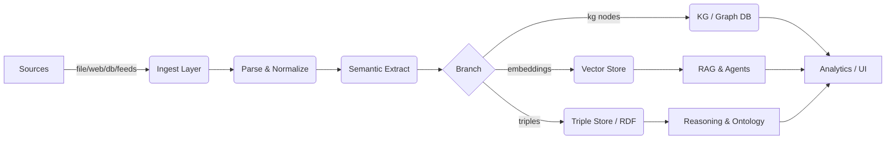
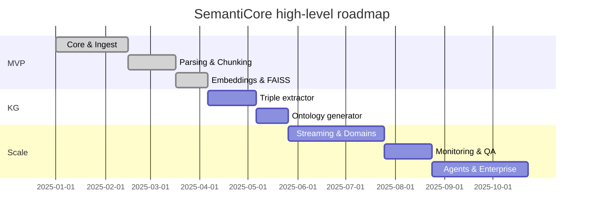

# SemantiCore — Modules, Features, Roadmap & Visuals

> **Purpose:** A concise engineering guide listing every module, feature, responsibilities, recommended tech, and visual diagrams to help you design, implement, and ship the SemantiCore open‑source semantic toolkit.

---

## 1. High-level overview

SemantiCore transforms raw, multi-format input into semantic knowledge (triples, ontologies, graphs, embeddings) suitable for RAG, multi-agent systems, GraphRAG, and domain-specific AI pipelines. The architecture is modular, pluggable, and cloud-native.

---

## 2. Modules (catalog)

Each module is a self-contained package with a clear public API.

1. **core**

   * Responsibilities: orchestration, pipeline runner, configuration, plugin registry, lifecycle management.
   * Exports: `SemantiCore`, `PipelineBuilder`, `Config`, `PluginManager`.

2. **ingest**

   * Submodules: `file`, `web`, `feed`, `stream`, `repo`, `email`, `db_export`.
   * Features: format detection, connector registry, backpressure support, incremental ingestion, resume tokens.

3. **parse**

   * Submodules: `pdf`, `docx`, `pptx`, `excel`, `html`, `jsonl`, `csv`, `latex`, `images`, `tables`.
   * Features: layout-aware extraction, OCR integration (Tesseract/Google Vision), table extraction (Camelot, Tabula), figure extraction.

4. **normalize**

   * Responsibilities: text cleaning, language detection, encoding normalization, named entity canonicalization, date normalization.

5. **split**

   * Chunking strategies: sliding window, semantic chunking, structural (section-aware), table-aware splitting.
   * Preserves provenance for each chunk.

6. **semantic\_extract**

   * Capabilities: NER, relation extraction, event detection, co-reference resolution, entity linking, triple extraction.
   * Backends: spaCy, Stanza, HuggingFace pipelines, LLM prompts (for complex relations).

7. **ontology**

   * OntologyGenerator: infer classes/properties, generate OWL/RDF, map to base ontologies (schema.org, FOAF, DC), versioning.

8. **triple\_store**

   * Adapters: Blazegraph, Apache Jena, RDF4J, GraphDB, Virtuoso — export/import, bulk load.

9. **kg** (knowledge graph)

   * Graph builder, entity resolution, deduplication, seed manager, provenance, conflict detector, conflict resolution UI hooks.

10. **embeddings**

    * SemanticEmbedder: multi-modal embeddings, context windows, pooling strategies, embedding provider adapters (OpenAI, BGE, Llama‑embeddings).

11. **vector\_store**

    * Adapters: Pinecone, FAISS, Milvus, Weaviate, Qdrant. Features: namespace, metadata store, hybrid search.

12. **reasoning**

    * Inference rules, SPARQL-based reasoning, Rete-like rule engine hooks, abductive/deductive inference.

13. **pipeline**

    * PipelineBuilder, failure/retry semantics, parallelism strategies, resource scheduling.

14. **streaming**

    * Integration: Kafka, Pulsar, RabbitMQ, Kinesis; exactly-once semantics where feasible; checkpoints.

15. **domains**

    * Domain-specific processors (cybersecurity, biomedical, finance, legal). Each provides templates, mapping rules, ontologies, and extractors.

16. **qa\_rag**

    * RAG-optimised tools: semantic chunker, prompt templates, retrieval policies, answer justification, provenance-aware answer builder.

17. **agents**

    * Agent manager & orchestration for multiagent workflows, tools for tool‑use, orchestration policies, cost-awareness, sandboxing.

18. **ui**

    * Web dashboard components: ingestion monitor, KG viewer (graph UI), conflict resolver, analytics dashboard, pipeline editor.

19. **monitoring**

    * Metrics, traces (OpenTelemetry), alerts, SLAs, data quality metrics, semantic quality score.

20. **quality**

    * QA, validation engine, schema validation, unit tests for extracted triples, confidence thresholds.

21. **security**

    * Access control (RBAC), data masking, PII redaction, audit logs, encryption helpers.

22. **deploy**

    * K8s manifests, Helm charts, Dockerfiles, autoscaling policies, GPU scheduling guides.

23. **cli**

    * Lightweight CLI for quick ingestion, building KB, exporting triples, running QA checks.

24. **examples**

    * Cookbooks and minimal reproducible examples across domains.

25. **docs**

    * Sphinx/ReadTheDocs-ready documentation with tutorials and API reference.

---

## 3. Features (by user story)

* **As a data engineer** I want pluggable ingestors so I can add new connectors quickly.
* **As an ontology engineer** I want automatic ontology suggestions and human-in-the-loop refinement.
* **As an analyst** I want a KG browser that shows provenance and conflict highlights.
* **As an ML engineer** I want RAG-ready semantic chunks with embeddings and retrieval tuning.
* **As a security engineer** I want PII detection and masking before storing embeddings.

---

## 4. Recommended tech stack (per module)

* Language: Python 3.10+ (type hints, pydantic models)
* Async: `asyncio` + `anyio` for I/O bound ingestion
* Parsing: `pdfplumber`, `PyMuPDF`, `python-docx`, `openpyxl`, `beautifulsoup4`
* OCR: `tesserocr` / Google Vision or AWS Textract adapters
* NLP: `spaCy`, `transformers`, `flair`, LLM adapters
* Vector stores: FAISS (local), Pinecone / Qdrant / Milvus
* KG: Neo4j for property graph + RDF store for triples
* Streaming: Kafka / Pulsar
* Infra: Docker + Kubernetes + Helm
* Monitoring: Prometheus + Grafana + OpenTelemetry
* CI/CD: GitHub Actions, dependabot

---

## 5. Architecture — dataflow diagram (Mermaid)



---

## 6. Roadmap (quarterly milestones)

```text
Q1 — MVP
 - core, ingest(file/web), parse(pdf/docx/html), split, embeddings(local FAISS), basic vector_store adapter
 - simple CLI

Q2 — KG + Triples
 - triple_extractor, ontology generator, triple store adapter, deduplication
 - basic KG UI

Q3 — Streaming & Domains
 - streaming connectors, feed processor, domain processors (cyber, biomedical)
 - monitoring & QA

Q4 — Agents & Enterprise
 - multi-agent orchestration, advanced reasoning, RBAC, production K8s charts, enterprise docs
```

---

## 7. Visual charts

### 7.1 Module size and priority (simple bar chart)

```
Modules Priority
core           ██████████ 10
ingest         █████████  9
parse          ████████   8
semantic_extract ████████ 8
embeddings     ███████    7
vector_store   ███████    7
kg             ████████   8
ontology       ██████     6
ui             █████      5
monitoring     █████      5
agents         ████       4
```

### 7.2 Gantt-style timeline (Mermaid)



---

## 8. Design notes & implementation guidance

* **Start small**: implement `core`, `ingest.file`, `parse.pdf`, `split` and `embeddings` with local FAISS. Aim for *end-to-end* pipeline that takes a PDF and returns embeddings + triples.
* **Provenance-first**: every chunk, triple, and entity MUST carry source, offset, and confidence.
* **Schema-first approach**: let teams register Pydantic models (business entities) early — this simplifies downstream validation and UX.
* **Human-in-loop**: provide UIs for ontology review, conflict resolution, and triple acceptance.
* **Test coverage**: unit tests for extractors, golden files for parsers, and integration tests that simulate full pipelines.
* **Performance**: make parsing idempotent and resumable; add caching at the ingest and embedder layers.

---

## 9. CI/CD, release & contributor guidelines

* Monorepo with packages under `packages/` using `poetry` or `flit`.
* Pre-commit hooks (black, isort, ruff, mypy), unit tests on GitHub Actions, release automation for PyPI and DockerHub.
* CONTRIBUTING.md with code style, PR checklist, and issue template.

---

## 10. Deliverables (file list for initial repo scaffolding)

```
/README.md
/pyproject.toml
/packages/core/
/packages/ingest/
/packages/parse/
/packages/split/
/packages/semantic_extract/
/packages/embeddings/
/packages/vector_store/
/packages/kg/
/packages/ontology/
/packages/cli/
/docs/
/examples/
/infra/k8s/
/helm/semanticore/
/.github/workflows/
```

---

## 11. Starter tasks (first sprint — 2 weeks)

1. Scaffold repo and package layout.
2. Implement `core` and a `file` ingestor that accepts local directories and single files.
3. Implement `pdf` parser using `pdfplumber` that returns structured blocks and simple tables.
4. Implement `split` with structural and sliding-window modes.
5. Implement `SemanticEmbedder` with local huggingface mini-embedding and persist to FAISS.
6. Add basic unit tests and a demo notebook that shows E2E from PDF -> embeddings -> search.

---

## 12. Example API usage (reference)

```python
from semanticore import SemantiCore

core = SemantiCore(
    config_path="./config.yaml",
    llm_provider="local",
    vector_store="faiss"
)

kb = core.build_knowledge_base(["./sample_docs/"])
print(kb.search("key trends"))
```

---

## 13. Next steps / how I can help

If you want, I can:

* Expand each module into a `README.md` + `__init__.py` template for the repo scaffold.
* Generate a prioritized ticket backlog (Jira/GitHub issues format).
* Create starter code for `core`, `file` ingestor, `pdf` parser and a demo notebook.

---

*End of file.*
