<div align="center">
  
</div>

# Semantica

[](https://www.python.org/downloads/)
[](https://opensource.org/licenses/MIT)
[](https://badge.fury.io/py/semantica)
[](https://pepy.tech/project/semantica)
[](https://semantica.readthedocs.io/)
[](https://discord.gg/semantica)

**Open Source Framework for Semantic Intelligence & Knowledge Engineering**

> **Transform chaotic data into intelligent knowledge.**

*The missing fabric between raw data and AI engineering. A comprehensive open-source framework for building semantic layers and knowledge engineering systems that transform unstructured data into AI-ready knowledge — powering Knowledge Graph-Powered RAG (GraphRAG), AI Agents, Multi-Agent Systems, and AI applications with structured semantic knowledge.*

**🆓 100% Open Source** • **📜 MIT Licensed** • **🚀 Production Ready** • **🌍 Community Driven**

---

<div class="grid cards" markdown>

-   :material-rocket-launch: **Quick Start**
    ---
    Get up and running with Semantica in minutes.
    
    [Get Started](getting-started.md)

-   :material-book-open-page-variant: **Core Concepts**
    ---
    Understand the fundamental concepts behind Semantica.
    
    [Learn Concepts](concepts.md)

-   :material-code-braces: **API Reference**
    ---
    Detailed documentation for all Semantica modules.
    
    [View API](reference/core.md)

-   :material-chef-hat: **Cookbook**
    ---
    Interactive tutorials and real-world examples.
    
    [Explore Cookbook](cookbook.md)

</div>

## 🌟 What is Semantica?

Semantica is the **first comprehensive open-source framework** that bridges the critical gap between raw data chaos and AI-ready knowledge. It's not just another data processing library—it's a complete **semantic intelligence platform** that transforms unstructured information into structured, queryable knowledge graphs that power the next generation of AI applications.

### The Vision

In the era of AI agents and autonomous systems, data alone isn't enough. **Context is king**. Semantica provides the semantic infrastructure that enables AI systems to truly understand, reason about, and act upon information with human-like comprehension.

### What Makes Semantica Different?

| Traditional Approaches | Semantica's Approach |
|------------------------|---------------------|
| Process data as isolated documents | Understands semantic relationships across all content |
| Extract text and store vectors | Builds knowledge graphs with meaningful connections |
| Generic entity recognition | General-purpose ontology generation and validation |
| Manual schema definition | Automatic semantic modeling from content patterns |
| Disconnected data silos | Unified semantic layer across all data sources |
| Basic quality checks | Production-grade QA with conflict detection & resolution |

---

## 🎯 The Problem We Solve

### The Data-to-AI Gap

Modern organizations face a fundamental challenge: **the semantic gap between raw data and AI systems**.

```mermaid
graph TD
    subgraph RawData [Raw Data Chaos]
        direction TB
        A[📄 PDFs & Docs]
        B[📧 Emails & Chat]
        C[💾 Databases]
        D[🌐 Web Content]
    end

    subgraph Gap [THE SEMANTIC GAP]
        direction TB
        X{❌ MISSING LAYER}
        X1[No Context]
        X2[No Relationships]
        X3[No Validation]
        X --> X1
        X --> X2
        X --> X3
    end

    subgraph AI [AI Systems Needs]
        direction TB
        F[🤖 AI Agents]
        G[🔍 GraphRAG]
        H[🧠 Reasoning]
        I[🤝 Multi-Agent]
    end

    RawData == "Unstructured Noise" ==> Gap
    Gap == "Hallucinations & Errors" ==> AI
    
    style Gap fill:#ffebee,stroke:#ff5252,stroke-width:2px,stroke-dasharray: 5 5
    style RawData fill:#f5f5f5,stroke:#9e9e9e,stroke-width:1px
    style AI fill:#e3f2fd,stroke:#2196f3,stroke-width:1px
```



### Real-World Consequences

**Without a semantic layer:**

<div class="grid cards" markdown>

-   **RAG Systems Fail**
    ---
    Vector search alone misses crucial relationships. No graph traversal for context expansion leads to 30% lower accuracy than hybrid approaches.

-   **AI Agents Hallucinate**
    ---
    No ontological constraints to validate actions. Missing semantic routing for intent understanding and no persistent memory across conversations.

-   **Multi-Agent Coordination Fails**
    ---
    No shared semantic models for collaboration. Unable to validate actions against domain rules, leading to conflicting knowledge representations.

-   **Knowledge Is Untrusted**
    ---
    Duplicate entities pollute graphs. Conflicting facts from different sources with no provenance tracking or validation.

</div>

### The Semantica Solution

Semantica fills this gap with a **complete semantic intelligence framework**:

```mermaid
graph LR
    subgraph Input [📥 Input Layer]
        direction TB
        I1[Files & Docs]
        I2[API Streams]
        I3[Databases]
    end

    subgraph Core [🧠 Semantica Engine]
        direction TB
        S1[Entity Extraction]
        S2[Relation Mapping]
        S3[Ontology Gen]
        S4[Conflict Resolution]
        S1 --> S2
        S2 --> S3
        S3 --> S4
    end

    subgraph Output [📤 Knowledge Output]
        direction TB
        O1[Knowledge Graph]
        O2[Vector Store]
        O3[Reasoning API]
    end

    Input == "Ingest" ==> Core
    Core == "Synthesize" ==> Output

    style Core fill:#e8f5e9,stroke:#4caf50,stroke-width:2px
    style Input fill:#fff3e0,stroke:#ff9800,stroke-width:1px
    style Output fill:#f3e5f5,stroke:#9c27b0,stroke-width:1px
```



---

## 📦 Installation

=== "From Source"

    Since Semantica is currently in development, install from the local source:

    ```bash
    # Navigate to the semantica directory
    cd path/to/semantica

    # Install in editable mode with core dependencies
    pip install -e .

    # Or install with all optional dependencies
    pip install -e ".[all]"
    ```

=== "Development"

    ```bash
    # Clone the repository
    git clone https://github.com/semantica-dev/semantica.git
    cd semantica

    # Install in editable mode with dev dependencies
    pip install -e ".[dev]"
    ```

=== "Custom"

    ```bash
    # Install specific extras as needed
    pip install -e ".[llm-openai]"        # LLM providers
    pip install -e ".[graph-neo4j]"       # Graph databases
    pip install -e ".[vector-pinecone]"   # Vector stores
    pip install -e ".[dev]"               # Development tools
    pip install -e ".[gpu]"               # GPU support
    ```

!!! note
    Once published to PyPI, you'll be able to install with `pip install semantica`

---

## ✨ Core Capabilities

### 1. 📊 Universal Data Ingestion

Process **50+ file formats** with intelligent semantic extraction:

<div class="grid cards" markdown>

-   __📄 Documents__
    ---
    - PDF (with OCR)
    - DOCX, XLSX, PPTX
    - TXT, RTF, ODT
    - EPUB, LaTeX
    - Markdown, RST

-   __🌐 Web & Feeds__
    ---
    - HTML, XHTML, XML
    - RSS, Atom feeds
    - JSON-LD, RDFa
    - Sitemap XML
    - Web scraping

-   __💾 Structured Data__
    ---
    - JSON, YAML, TOML
    - CSV, TSV, Excel
    - Parquet, Avro, ORC
    - SQL databases
    - NoSQL databases

-   __📧 Communication__
    ---
    - EML, MSG, MBOX
    - PST archives
    - Email threads
    - Attachment extraction

-   __🗜️ Archives__
    ---
    - ZIP, TAR, RAR, 7Z
    - Recursive processing
    - Multi-level extraction

-   __🔬 Scientific__
    ---
    - BibTeX, EndNote, RIS
    - JATS XML
    - PubMed formats
    - Citation networks

</div>
