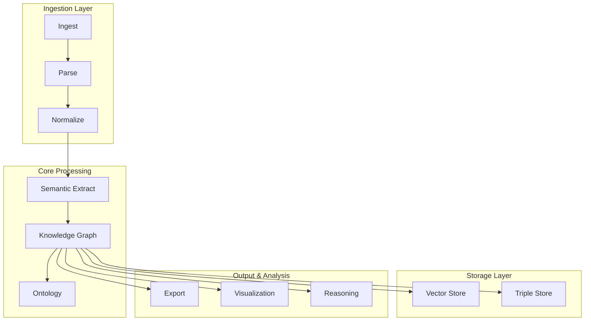

# Modules & Architecture

Semantica is built with a modular architecture, designed to be flexible and extensible. This guide provides an overview of the key modules and their responsibilities.

## 🏗️ Architecture Overview

The framework is organized into several core layers:

## 📦 Core Modules

-   :material-cube-outline: **[Core](reference/core.md)**
    ---
    The foundation of the framework. Handles configuration, logging, and base classes.

-   :material-file-import: **[Ingest](reference/ingest.md)**
    ---
    Handles the loading of data from various sources (50+ formats).

-   :material-file-code: **[Parse](reference/parse.md)**
    ---
    Parses raw data into structured text and metadata, including OCR.

-   :material-format-align-left: **[Normalize](reference/normalize.md)**
    ---
    Cleans and standardizes extracted text and encoding.

-   :material-brain: **[Semantic Extract](reference/semantic_extract.md)**
    ---
    Extracts meaning, entities, and relations using LLMs and NLP.

-   :material-graph: **[Knowledge Graph](reference/kg.md)**
    ---
    The central module for building and managing knowledge graphs.

-   :material-vector-curve: **[Embeddings](reference/embeddings.md)**
    ---
    Generates vector embeddings for text and graph nodes.

-   :material-database: **[Vector Store](reference/vector_store.md)**
    ---
    Manages vector storage (Pinecone, Chroma, Qdrant).

-   :material-database-search: **[Triple Store](reference/triple_store.md)**
    ---
    Manages RDF triple storage (Neo4j, RDFLib).

-   :material-shape: **[Ontology](reference/ontology.md)**
    ---
    Defines and validates the schema of the knowledge graph.

-   :material-lightbulb: **[Reasoning](reference/reasoning.md)**
    ---
    Performs logical reasoning and inference over the graph.

-   :material-pipe: **[Pipeline](reference/pipeline.md)**
    ---
    Orchestrates the end-to-end processing flow.

-   :material-export: **[Export](reference/export.md)**
    ---
    Exports the knowledge graph to JSON, RDF, CSV, GEXF, etc.

-   :material-chart-bubble: **[Visualization](reference/visualization.md)**
    ---
    Tools for interactive graph plotting and HTML export.

-   :material-tools: **[Utils](reference/utils.md)**
    ---
    General utility functions for file I/O and string manipulation.

## 🧩 Submodules

Each module contains specialized submodules. For example:

- **`semantica.ingest`**
    - `loaders`: Specific file loaders
    - `stream`: Streaming data handlers
- **`semantica.kg`**
    - `builder`: Graph construction logic
    - `query`: Graph query interface
- **`semantica.semantic_extract`**
    - `llm`: LLM-based extraction
    - `spacy`: NLP-based extraction

For detailed API documentation, please refer to the specific **API Reference** pages linked above.
